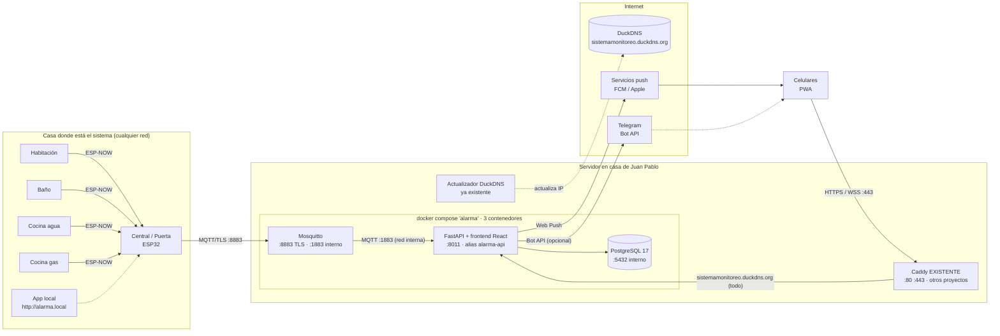
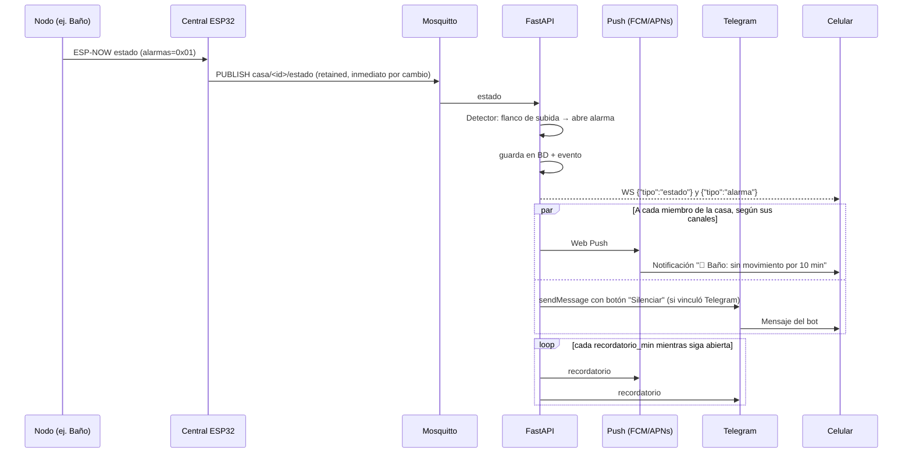
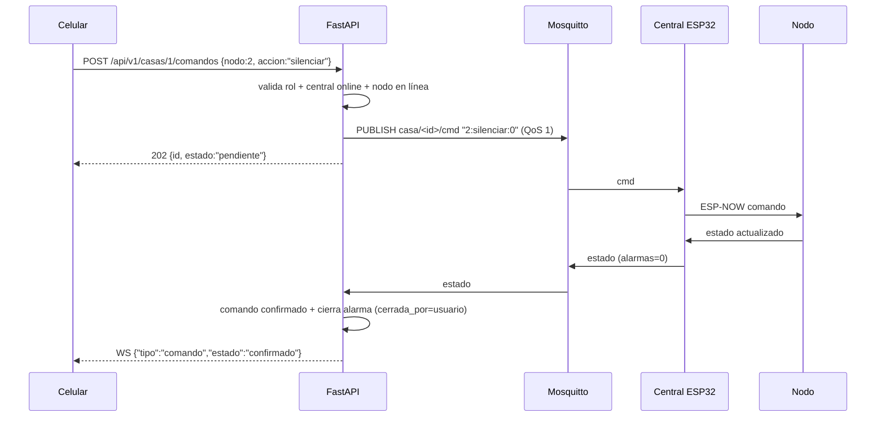
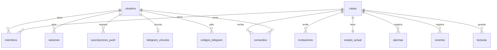
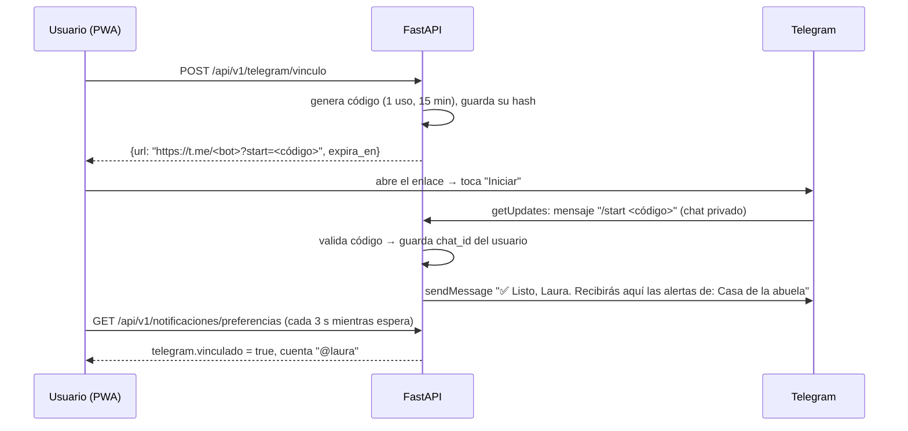

# Sistema de monitoreo doméstico — Arquitectura del backend

> **Versión:** 1.9 · **Fecha:** 28/09/2026 · **Autor:** Juan Pablo (con Claude)
> **Objetivo del documento:** especificación completa para desarrollar el backend y la app web con Claude Code.
> **Alcance:** backend, infraestructura y frontend. **El firmware de las ESP32 ya existe y NO se modifica**; solo se le cambian valores de configuración (§12.9).
>
> **Stack definitivo (1.4):**
> - El servidor **ya tiene Caddy y Docker** con otros proyectos. Este proyecto **solo agrega la app**: **3 contenedores**, cada servicio en el suyo: `mosquitto`, `api` (FastAPI, que también sirve el frontend **React** compilado) y `db` (**PostgreSQL 17**). La app escucha en el puerto **8011**.
> - Se integra con el **Caddy existente** agregando un bloque de 3 líneas a su Caddyfile (§5.3). No se usan nginx ni certbot.
> - El **actualizador de DuckDNS ya existe** en el servidor y no forma parte del proyecto.
>
> **Cambios en 1.6:** decisiones de la §17 confirmadas. Nuevo canal **Telegram opcional por usuario** (§10.7): vinculación por enlace, botón Silenciar, preferencias por usuario, tablas, endpoints, pruebas y fase F4b.
>
> **Cambios en 1.7:** dominio definitivo **`sistemamonitoreo.duckdns.org`** (P1 resuelto).
>
> **Cambios en 1.8:** frontend en **React 19 + TypeScript 5.9 + Vite 8** (PWA), compilado dentro de la imagen de la API: sigue habiendo 3 contenedores y el mismo bloque de Caddy. URLs limpias (`/casa/1`), tipos compartidos por OpenAPI, CSP, pruebas del frontend y fases actualizadas.
>
> **Cambios en 1.9:** decisiones S10–S14 (§17), tras contrastar la especificación con el firmware: recordatorios de conexión espaciados, detección de eventos nuevos de la central sin hash, lecturas solo de nodos en línea, mensajes retenidos que no cambian `recibido_en` y usuario MQTT del backend `backend_api`. Además se precisan `cerrada_por = "automatica"`, los cambios de horario de la habitación, la interpolación de contadores, el orden de arranque de Mosquitto y el contenido de cada fase (§14), cuyo detalle está en [`PLAN_IMPLEMENTACION.md`](PLAN_IMPLEMENTACION.md).

---

## Índice

1. [Contexto y decisiones](#1-contexto-y-decisiones)
2. [Arquitectura general](#2-arquitectura-general)
3. [Stack tecnológico](#3-stack-tecnológico)
4. [Contrato con la central (firmware existente)](#4-contrato-con-la-central-firmware-existente)
5. [Infraestructura (Docker, Mosquitto, PostgreSQL e integración con Caddy)](#5-infraestructura)
6. [Backend: módulos y flujo interno](#6-backend-módulos-y-flujo-interno)
7. [Base de datos](#7-base-de-datos)
8. [API REST](#8-api-rest)
9. [WebSocket](#9-websocket)
10. [Notificaciones (Web Push y Telegram)](#10-notificaciones-web-push-y-telegram)
11. [Frontend (React, PWA)](#11-frontend-react-pwa)
12. [Seguridad](#12-seguridad)
13. [Pruebas](#13-pruebas)
14. [Plan de desarrollo por fases](#14-plan-de-desarrollo-por-fases)
15. [Despliegue paso a paso](#15-despliegue-paso-a-paso)
16. [Operación y mantenimiento](#16-operación-y-mantenimiento)
17. [Decisiones confirmadas y pendientes](#17-decisiones-confirmadas-y-pendientes)
18. [Guía para Claude Code](#18-guía-para-claude-code)

---

## 1. Contexto y decisiones

### 1.1 El sistema que ya existe

Son 5 ESP32 comunicadas por **ESP-NOW**:

| ID | Nodo | Sensores | Alarma |
|---|---|---|---|
| 0 | Puerta de entrada (**central / gateway**) | PIR + buzzer | Movimiento en la madrugada (00:00–06:00) |
| 1 | Habitación | PIR + buzzer | 30 min sin movimiento (pausa automática 22:00–06:00) |
| 2 | Baño | PIR + buzzer | 10 min sin movimiento después de detectar a alguien |
| 3 | Cocina · agua | Sensor de flujo + buzzer | Agua corriendo > 8 min |
| 4 | Cocina · gas | MQ + DS18B20 + PIR + buzzer | Gas > 4 min · Temperatura > 56 °C · 20 min sin movimiento |

> Ojo al leer el firmware: sus comentarios numeran los nodos del 1 al 5 ("NODO 1 — PUERTA"), pero los IDs del protocolo, que son los que usa este documento, van de 0 a 4.

La **central** (nodo 0) ya hace varias cosas:

- Se conecta al WiFi de la casa donde esté instalada.
- Sirve una app local en `http://alarma.local`, que funciona sin internet.
- Publica su estado por **MQTT sobre TLS** y recibe comandos por el mismo canal.

Hasta ahora ese MQTT apuntaba a HiveMQ Cloud. **Con este proyecto pasa a apuntar al servidor propio.**

### 1.2 Decisiones tomadas

| # | Decisión | Motivo |
|---|---|---|
| D1 | **Servidor propio en la casa de Juan Pablo**, expuesto con **DuckDNS** | Control total y sin costo mensual. |
| D2 | La **ESP32 está en otra red** (se mueve de casa) y se conecta **por internet** al dominio DuckDNS | Es el caso de uso real. Por eso el broker MQTT se expone a internet con TLS. |
| D3 | **FastAPI + Mosquitto** (MQTT se mantiene entre la ESP32 y el servidor) | El firmware no cambia. MQTT ya resuelve reconexión, estado retenido, LWT y QoS. |
| D4 | **Solo FastAPI queda expuesto a los celulares** (vía Caddy); el navegador **no** habla MQTT | Login real, credenciales MQTT fuera del celular, lógica centralizada. |
| D5 | **Notificaciones: Web Push** (PWA, Android e iPhone) como canal base + **Telegram opcional por usuario** | Web Push no requiere app nativa (en iPhone hay que instalar la PWA, iOS ≥ 16.4). Telegram puede sonar con el celular en silencio y trae botón "Silenciar" en ambos sistemas. |
| D6 | **Usuarios con roles**: `admin` y `cuidador` por casa, más un `superadmin` global | Varios cuidadores con acceso propio y revocable. |
| D7 | **PostgreSQL 17 en Docker**, sin puertos publicados (solo red interna) | Motor robusto y concurrente. Tipos `TIMESTAMPTZ` y `JSONB`, índices parciales, `date_bin` para gráficas. Respaldos con `pg_dump`. |
| D8 | **Frontend en React 19 + TypeScript + Vite (PWA)**, compilado **dentro de la imagen de la API** y servido por FastAPI (§6.7) | Con 9 vistas, roles, tiempo real, formularios y gráficas, React da estructura y tipos compartidos con la API (OpenAPI). Compilarlo en la imagen evita otro contenedor y deja el Caddy con un solo `reverse_proxy`. |
| D9 | **TLS del MQTT con una CA propia** (certificado autofirmado de 10 años) | La central usa `setInsecure()`. Una CA propia evita renovar cada 90 días y permite fijar el certificado en la ESP32 más adelante (§12.6). |
| D10 | **La central ya no envía Telegram** (`USAR_TELEGRAM 0`); ahora lo envía el **backend**, por usuario | Un solo lugar decide a quién avisar y por qué canal, y los mensajes pueden llevar un botón para silenciar con la identidad de quien lo toca. |
| D11 | **Caddy existente** en el servidor como reverse proxy (HTTPS automático). La app solo le agrega un bloque (§5.3) | Ya está instalado y emite los certificados de los otros proyectos. No se despliega otro proxy: dos procesos no pueden usar los puertos 80/443. |
| D12 | **3 contenedores, un servicio por contenedor**: `mosquitto`, `api`, `db`, en un compose propio (`name: alarma`). El actualizador de DuckDNS ya existe y no se incluye | Cada servicio se reinicia, actualiza y revisa por separado, y el proyecto no interfiere con los demás del servidor. |
| D13 | Telegram por **long polling** (`getUpdates`), **sin webhook** | No requiere otra ruta pública ni tocar el Caddy compartido, y funciona igual en desarrollo local. |

---

## 2. Arquitectura general



### Redes de Docker

| Red | Servicios | Propósito |
|---|---|---|
| `proxy` (externa: `${RED_PROXY}`, la del Caddy existente) | Caddy, `api` (alias `alarma-api`) y contenedores de otros proyectos | Caddy llega a la API. |
| `interna` (propia del proyecto) | api, db, mosquitto | Ni Caddy ni los otros proyectos alcanzan la base de datos ni el broker. |

### 2.1 Puertos expuestos en el router de Juan Pablo

| Puerto | Protocolo | Destino | Uso |
|---|---|---|---|
| 80 | TCP | Caddy existente | **Ya abierto** (otros proyectos). Reto ACME del nuevo hostname |
| 443 | TCP | Caddy existente | **Ya abierto**. App, API REST y WebSocket |
| 8883 | TCP | Mosquitto (este proyecto) | **Único puerto nuevo a abrir**: MQTT sobre TLS para las centrales |

La app escucha en el **8011**, solo en `127.0.0.1` del servidor y en la red del proxy: **no** se abre en el router, porque el acceso desde internet entra por el Caddy (443).

El puerto 1883 (MQTT sin cifrar) y el 5432 (PostgreSQL) **nunca** se publican; solo existen dentro de las redes de Docker.

### 2.2 Flujo de una alarma



### 2.3 Flujo de un comando (silenciar, activar o desactivar)



---

## 3. Stack tecnológico

### 3.1 Backend

| Componente | Tecnología | Versión mínima | Notas |
|---|---|---|---|
| Lenguaje | Python | 3.12 | |
| Framework web | FastAPI | 0.115 | |
| Servidor ASGI | Uvicorn (`uvicorn[standard]`) | 0.30 | **1 solo worker** (ver §6.6) |
| Validación | Pydantic v2 + `pydantic-settings` | 2.7 | Configuración por variables de entorno |
| ORM | SQLAlchemy 2.0 (async) + `asyncpg` | 2.0 / 0.29 | Pool: `pool_size=5`, `max_overflow=5`, `pool_pre_ping=True` |
| Migraciones | Alembic (plantilla `async`) | 1.13 | Se ejecutan al arrancar el contenedor (`alembic upgrade head`) |
| Cliente MQTT | `aiomqtt` | 2.x | Tarea asyncio dentro del `lifespan` |
| Web Push | `pywebpush` (incluye `py-vapid`) | 2.0 | Síncrono → se ejecuta en threadpool |
| Telegram | `httpx` (cliente async de la Bot API, sin librería de bots) | 0.27 | Opcional: solo si `TELEGRAM_BOT_TOKEN` está definido (§10.7) |
| Hash de claves | `pwdlib[argon2]` | 0.2 | Argon2id |
| Pruebas | `pytest`, `pytest-asyncio`, `httpx`, `respx`, `testcontainers[postgres]` | | PostgreSQL real y efímero; `respx` simula la Bot API de Telegram |
| Calidad | `ruff` (lint + formato), `mypy` (opcional) | | |
| Dependencias | `pyproject.toml`; instalación con `uv` en el Dockerfile | | Las de pruebas y calidad van en un grupo `dev` y no entran en la imagen |

### 3.2 Infraestructura

| Contenedor | Imagen Docker | Función |
|---|---|---|
| `mosquitto` | `eclipse-mosquitto:2` | Broker MQTT |
| `api` | Build multi-etapa: `node:24-alpine` compila React → `python:3.12-slim` | FastAPI: API, WebSocket y frontend compilado |
| `db` | `postgres:17-alpine` | Base de datos |

Ya existentes en el servidor (no forman parte del proyecto): **Caddy** (reverse proxy y HTTPS) y el **actualizador de DuckDNS**.

### 3.3 Frontend

Versiones **verificadas el 28/09/2026**, compilando un esqueleto con este stack. En `package.json` se usan rangos `^` sobre ellas, salvo TypeScript, que va fijo.

| Pieza | Tecnología | Versión | Notas |
|---|---|---|---|
| Lenguaje | TypeScript (`strict`) | **~5.9** (fija) | **No usar TypeScript 7 todavía:** `typescript-eslint` exige `<6.1` y `openapi-typescript` exige `^5` |
| UI | React + React DOM | 19.3 | |
| Build y servidor de desarrollo | Vite + `@vitejs/plugin-react` | 8.3 / 6.1 | En producción se compila **dentro de la imagen de la API** (§5.2) |
| Rutas | React Router (`createBrowserRouter`, paquete `react-router`) | 8.4 | URLs limpias; FastAPI devuelve `index.html` en las rutas del cliente (§6.7). **Exige Node ≥ 22.22** |
| Datos del servidor | TanStack Query | 5.104 | Caché, reintentos y mutaciones. El WebSocket escribe en su caché (§11.3) |
| Cliente HTTP tipado | `openapi-fetch` + `openapi-typescript` | 0.17 / 7.13 | Tipos generados del OpenAPI de FastAPI (§11.7) |
| Estilos | Tailwind CSS + `@tailwindcss/vite` | 4.3 | Modo oscuro con `prefers-color-scheme` |
| Componentes | shadcn/ui (Radix) copiados al repo, `lucide-react` (íconos), `sonner` (avisos) | CLI shadcn 4 · sonner 2 | Solo los necesarios: Button, Input, Switch, Dialog, Tabs, Badge, DropdownMenu |
| Gráficas | Recharts | 3.10 | Solo en la vista de gráficas, con carga diferida |
| PWA | `vite-plugin-pwa` (`injectManifest`) + `workbox-precaching` + `workbox-routing` | 1.3 / 7.4 | Service worker propio en `src/sw.ts`, que se compila a `dist/sw.js` (§11.5) |
| Pruebas | Vitest, Testing Library (`@testing-library/react`), MSW, `jsdom` | 5.0 / 16.3 / 3.0 | §13.5 |
| Calidad | ESLint + `typescript-eslint` + `eslint-plugin-react-hooks`, Prettier | 10 / 8.71 / 7 · 3.9 | |
| Node.js (solo build y desarrollo) | Node **24 LTS** | ≥ 22.22 | En Docker: `node:24-alpine`. En el equipo de desarrollo, Node 24. **El servidor no necesita Node instalado** |

**Prueba de humo del stack (28/09/2026):**
- `tsc -b && vite build` sin errores;
- `vite-plugin-pwa` generó `dist/sw.js` desde `src/sw.ts`, con `manifest.webmanifest`;
- `openapi-typescript` generó los tipos y `openapi-fetch` los usó;
- Vitest pasó;
- `npm ls` sin conflictos de dependencias;
- chunk inicial con React, Router, Query, cliente y Tailwind: **111 KB gzip**. La vista diferida (gráficas) salió en un chunk aparte.

La lógica de la app actual se **porta a TypeScript**: bits del protocolo, `textosAlarma()` y las reglas de cada tarjeta (`detalle()`). Queda en `src/dominio/`, con pruebas.

### 3.4 Convenciones

- **Nombres del dominio en español**, igual que en el firmware: `casa`, `nodo`, `alarma`, `evento`, `comando`, `habilitado`.
- Nombres técnicos genéricos en inglés cuando sea lo idiomático (`router`, `service`, `schema`).
- Frontend: componentes en PascalCase y hooks `useAlgo`, con nombres del dominio en español (`TarjetaNodo`, `useCasaEnVivo`).
- Fechas en BD y API en **UTC ISO-8601**. La UI las muestra en `America/Bogota`.
- Rutas de API bajo **`/api/v1`**.
  - Importante: la app local de la ESP32 detecta el "modo casa" pidiendo `/api/estado`. En el dominio del servidor esa ruta debe devolver 404 para que no haya confusión.

---

## 4. Contrato con la central (firmware existente)

> Esta sección es la **fuente de verdad** del protocolo. El backend debe adaptarse a ella; el firmware no se toca.
> Referencias en el código de Arduino: `protocolo.h` y `gateway_puerta.ino` (funciones `jsonEstado()`, `atenderMqtt()` y `procesarComandoRemoto()`).

### 4.1 Conexión MQTT de la central

| Parámetro | Valor en el firmware |
|---|---|
| Host / puerto | `MQTT_HOST` / `MQTT_PUERTO` (8883, TLS) |
| TLS | `WiFiClientSecure::setInsecure()`: cifra pero **no valida** el certificado del servidor |
| Client ID | `central-<ID_CASA>` |
| Usuario / clave | `MQTT_USUARIO` / `MQTT_CLAVE`. **En este servidor el usuario debe ser igual a `ID_CASA`** (lo exige el ACL, §5.4). |
| Keep-alive | 30 s |
| Buffer | 6144 bytes |
| LWT | tópico `casa/<ID_CASA>/online`, payload `"0"`, QoS 1, **retained** |
| Reintento de conexión | cada 10 s |

`ID_CASA` debe cumplir `^[a-z0-9-]{4,40}$` (se usa en tópicos y como usuario MQTT).

### 4.2 Tópicos

| Tópico | Dirección | QoS | Retained | Payload |
|---|---|---|---|---|
| `casa/<ID>/online` | central → servidor | 0 (`"1"`) · 1 (LWT `"0"`) | sí | `"1"` al conectar · `"0"` por LWT si se cae |
| `casa/<ID>/estado` | central → servidor | 0 | sí | JSON (§4.3) cada **5 s** e **inmediato** si cambian alarmas, habilitado, conexión de nodos o eventos |
| `casa/<ID>/cmd` | servidor → central | 1 | **no** | Texto plano (§4.5) |

### 4.3 Payload de `estado`

```json
{
  "hora": "27/09/2026 14:05:10",
  "horaValida": true,
  "red": "wifi",
  "nodos": [
    {"id":0,"nombre":"Puerta de entrada","visto":true,"enLinea":true,"hab":1,"al":0,"mov":0,"fl":64,"c1":0,"l1":0,"c2":0,"l2":0,"v1":0.00,"v2":0,"hace":0},
    {"id":1,"nombre":"Habitación","visto":true,"enLinea":true,"hab":1,"al":0,"mov":0,"fl":65,"c1":745,"l1":1800,"c2":0,"l2":0,"v1":0.00,"v2":0,"hace":2},
    {"id":2,"nombre":"Baño","visto":true,"enLinea":true,"hab":1,"al":1,"mov":0,"fl":64,"c1":0,"l1":600,"c2":0,"l2":0,"v1":0.00,"v2":0,"hace":1},
    {"id":3,"nombre":"Cocina · agua","visto":true,"enLinea":true,"hab":1,"al":0,"mov":1,"fl":65,"c1":212,"l1":480,"c2":0,"l2":0,"v1":6.40,"v2":0,"hace":1},
    {"id":4,"nombre":"Cocina · gas","visto":true,"enLinea":true,"hab":3,"al":0,"mov":0,"fl":66,"c1":0,"l1":240,"c2":300,"l2":1200,"v1":24.60,"v2":640,"hace":0}
  ],
  "eventos": [
    {"t":"27/09 14:04:58","x":"ALARMA Baño: sin movimiento por 10 min","a":true}
  ]
}
```

**Campos del nivel superior**

| Campo | Tipo | Descripción |
|---|---|---|
| `hora` | string | Hora local de la central, `dd/mm/YYYY HH:MM:SS`. Si no tiene hora: `+<segundos>s` desde el arranque. |
| `horaValida` | bool | La central sincronizó NTP. |
| `red` | `"wifi"` \| `"ap"` | Siempre `"wifi"` cuando publica por MQTT. |
| `nodos` | array[5] | Siempre los 5 nodos, en orden de `id`. |
| `eventos` | array (≤ 15) | Bitácora interna de la central, del más reciente al más antiguo. **No tienen id único** (§6.4). |

**Campos de cada nodo**

| Campo | Tipo | Descripción |
|---|---|---|
| `id` | int 0–4 | Identificador del nodo (§1.1). |
| `nombre` | string | Nombre visible (UTF-8). |
| `visto` | bool | La central ha recibido al menos un mensaje del nodo desde que arrancó. |
| `enLinea` | bool | Último mensaje hace < 20 s. |
| `hab` | int (bits) | `0x01` = función principal activa · `0x02` = presencia (solo nodo 4). |
| `al` | int (bits) | Alarmas activas (§4.4). |
| `mov` | 0/1 | PIR detectando. En el nodo 3 significa "hay flujo de agua". |
| `fl` | int (bits) | Flags informativos (§4.4). |
| `c1` / `l1` | int (s) | Contador principal y su límite. |
| `c2` / `l2` | int (s) | Contador secundario y su límite (nodo 4: presencia). |
| `v1` | float | Nodo 3: caudal en L/min · Nodo 4: temperatura en °C. |
| `v2` | float | Nodo 4: lectura cruda del sensor de gas (0–4095). |
| `hace` | int (s) | Segundos desde el último mensaje del nodo. |

Significado de los contadores según el nodo:

| Nodo | `c1` / `l1` | `c2` / `l2` |
|---|---|---|
| 1 Habitación | Tiempo sin movimiento / 1800 s | — |
| 2 Baño | Tiempo sin movimiento / 600 s (solo si el flag `FL_CONTANDO1` está activo) | — |
| 3 Cocina · agua | Tiempo con agua corriendo / 480 s | — |
| 4 Cocina · gas | Tiempo con gas detectado / 240 s | Tiempo sin movimiento / 1200 s |

### 4.4 Bits (copiar tal cual a `app/protocolo.py`)

```python
# Alarmas (campo "al")
AL_SIN_MOVIMIENTO = 0x01   # nodos 1, 2, 4
AL_AGUA           = 0x02   # nodo 3
AL_GAS            = 0x04   # nodo 4
AL_TEMPERATURA    = 0x08   # nodo 4
AL_INTRUSION      = 0x10   # nodo 0

# Habilitado (campo "hab")
HAB_PRINCIPAL  = 0x01
HAB_SECUNDARIO = 0x02      # solo nodo 4 (presencia)

# Flags (campo "fl")
FL_CONTANDO1        = 0x01
FL_CONTANDO2        = 0x02
FL_HORARIO_NOCTURNO = 0x04   # nodo 1 en 22:00–06:00
FL_MADRUGADA        = 0x08   # nodo 0 en 00:00–06:00
FL_CALENTANDO       = 0x10   # sensor PIR o MQ calentando
FL_ERROR_SENSOR     = 0x20   # DS18B20 no responde
FL_HORA_VALIDA      = 0x40

NODOS = {0: "Puerta de entrada", 1: "Habitación", 2: "Baño", 3: "Cocina · agua", 4: "Cocina · gas"}
```

Mapeo de bit a tipo de alarma en el backend:

| Bit | Tipo (enum en BD) | Texto para notificación |
|---|---|---|
| `AL_INTRUSION` | `INTRUSION` | "Movimiento en la entrada durante la madrugada" |
| `AL_SIN_MOVIMIENTO` | `SIN_MOVIMIENTO` | "Sin movimiento por {l/60} min" (nodo 4 usa `l2`) |
| `AL_AGUA` | `AGUA` | "Agua corriendo más de {l1/60} min" |
| `AL_GAS` | `GAS` | "Gas detectado por más de {l1/60} min" |
| `AL_TEMPERATURA` | `TEMPERATURA` | "Temperatura alta: {v1:.1f} °C" |

### 4.5 Payload de `cmd`

Texto plano `"<nodo>:<accion>:<sub>"` o `"todo:silenciar"`. El firmware lo lee con un buffer de 48 caracteres.

| Comando | Efecto |
|---|---|
| `"<n>:activar:0"` | Activa la función principal del nodo `n` (0–4). |
| `"<n>:desactivar:0"` | La desactiva y borra sus alarmas. |
| `"4:activar:1"` / `"4:desactivar:1"` | Presencia del nodo 4 (cocina · gas). |
| `"<n>:silenciar:0"` | Apaga las alarmas del nodo y reinicia sus contadores. |
| `"todo:silenciar"` | Silencia todos los nodos con alarma. |

Comportamiento del firmware que el backend debe conocer:

- **No hay respuesta directa (ACK).** La confirmación se deduce del siguiente `estado` (§6.5).
- Si el nodo destino nunca se ha visto, el firmware **descarta** el comando sin avisar.
- La central registra el comando en su bitácora como `"App remota: <verbo> <nodo>"`.
- La habitación se **desactiva** sola **por horario** a las 22:00 y se **reactiva** a las 06:00 (lo hace su propio nodo, no la central). Un comando del cuidador se mantiene hasta el siguiente cambio de horario.

### 4.6 Casos borde del firmware

| Situación | Qué se ve en MQTT | Qué debe hacer el backend |
|---|---|---|
| La central reinicia | `online` = `"1"`. En el primer `estado`, los nodos tienen `visto:false` y `al:0` hasta que reportan (~3 s). | **No cerrar** alarmas de nodos con `visto:false` o `enLinea:false` (estado desconocido). |
| La central pierde internet o luz | Tras ~45 s el broker publica el LWT `online` = `"0"`. El último `estado` retenido queda congelado. | Marcar la casa offline; si dura más que `minutos_central_caida`, abrir la alarma `CENTRAL_DESCONECTADA`. |
| Un nodo se apaga | `enLinea:false` a los 20 s. `al` conserva el último valor. | Abrir `NODO_SIN_CONEXION`. No cerrar sus otras alarmas. |
| Silencio con el botón BOOT o desde la app local | `al` pasa a 0 sin comando del backend | Cerrar la alarma con `cerrada_por = "central"`. |
| La habitación entra o sale del horario nocturno | A las 22:00, en el mismo `estado`, `hab` del nodo 1 pasa a 0 y se activa `FL_HORARIO_NOCTURNO`; a las 06:00, al revés | Registrar el evento "Habitación desactivada (horario)" o "Habitación activada (horario)" (§6.4). No es una alarma. |

---

## 5. Infraestructura

### 5.1 Estructura del repositorio

```
alarma-hogar/
├── CLAUDE.md                    # instrucciones para Claude Code (§18)
├── README.md
├── docker-compose.yml
├── docker-compose.dev.yml       # solo desarrollo local (publica db y 1883 en localhost)
├── .env.example
├── .env                         # local, NO se versiona
├── .dockerignore                # node_modules, .venv, dist, tests, .git, .env, backups, mosquitto, firmware (§5.2)
├── .gitignore
├── .gitattributes               # finales de línea LF: los scripts y la config de Mosquitto se ejecutan en Linux
├── backups/                     # lo crea backup.sh, NO se versiona
├── caddy/
│   └── alarma.caddy            # bloque para pegar en el Caddyfile existente (referencia)
├── mosquitto/
│   ├── config/
│   │   ├── mosquitto.conf
│   │   ├── acl
│   │   └── passwd              # generado, NO se versiona
│   └── certs/                  # generado, NO se versiona (ca.*, server.*)
├── scripts/
│   ├── generar_certs_mqtt.sh
│   ├── usuario_mqtt.sh         # crea o actualiza usuarios de Mosquitto
│   └── backup.sh               # pg_dump + configuración
├── tools/
│   └── simulador_central.py    # central falsa para desarrollo y pruebas (usa el entorno de backend/)
├── backend/
│   ├── Dockerfile              # multi-etapa: compila frontend/ y arma la imagen de la API (§5.2)
│   ├── pyproject.toml          # dependencias, grupo dev, ruff y pytest
│   ├── alembic.ini
│   ├── migrations/
│   │   ├── env.py              # plantilla async
│   │   ├── script.py.mako
│   │   └── versions/           # 0001_inicial.py (F1) y 0002_telegram.py (F4b)
│   ├── app/                    # ver §6.1
│   └── tests/
│       ├── conftest.py         # PostgreSQL con testcontainers, sesion_db, cliente httpx
│       ├── fixtures/           # estado_*.json reales: normal, alarma, reinicio, sin hora
│       ├── unit/               # funciones puras: protocolo, detector, eventos, predicados, textos
│       └── integracion/        # API, BD, WebSocket, notificaciones, Telegram, web y OpenAPI
├── frontend/                   # React + TypeScript + Vite (estructura en §11.1); se compila en la imagen de la API
├── firmware/                   # copia de referencia del código de Arduino (solo lectura)
└── docs/
    ├── ARQUITECTURA.md         # este documento
    └── PLAN_IMPLEMENTACION.md  # orden de implementación por fases
```

### 5.2 `docker-compose.yml`

**Este proyecto agrega solo 3 contenedores:** `mosquitto`, `api` (FastAPI, que también sirve el frontend) y `db` (PostgreSQL).

**Lo que ya existe en el servidor y no se toca:**
- **Caddy**, con sus otros proyectos. La app se integra con él agregando un bloque a su Caddyfile (§5.3).
- **El actualizador de DuckDNS.**

Para no chocar con los otros proyectos:

| Riesgo | Cómo se evita |
|---|---|
| Nombres de contenedores y volúmenes repetidos | `name: alarma` en el compose → `alarma-api-1`, `alarma_pg_data`, … |
| Otro proyecto con un servicio `api` en la red del Caddy | En la red del proxy, la API se registra con el alias único **`alarma-api`** |
| Otro PostgreSQL en el servidor | El de este proyecto no publica puertos: vive solo en la red `interna` |
| Puertos 8011 u 8883 ocupados | Verificar antes con `sudo ss -tlnp \| grep -E ':(8011\|8883) '` (§15.1) |

```yaml
name: alarma

services:
  api:
    build:
      context: .                         # raíz del repo: el Dockerfile necesita frontend/ y backend/
      dockerfile: backend/Dockerfile
    restart: unless-stopped
    env_file: .env
    environment:
      - DATABASE_URL=postgresql+asyncpg://${POSTGRES_USER}:${POSTGRES_PASSWORD}@db:5432/${POSTGRES_DB}
    ports: ["127.0.0.1:8011:8011"]     # solo loopback del servidor: Caddy en el host o pruebas con curl; NO se expone a la red
    networks:
      proxy:
        aliases: [alarma-api]            # nombre único con el que el Caddy existente llega a la API
      interna: {}
    depends_on:
      db:
        condition: service_healthy
      mosquitto:
        condition: service_started
    healthcheck:
      test: ["CMD", "python", "-c", "import urllib.request;urllib.request.urlopen('http://localhost:8011/api/v1/salud')"]
      interval: 30s
      timeout: 5s
      retries: 3
      start_period: 20s

  db:
    image: postgres:17-alpine
    restart: unless-stopped
    environment:
      - POSTGRES_DB=${POSTGRES_DB}
      - POSTGRES_USER=${POSTGRES_USER}
      - POSTGRES_PASSWORD=${POSTGRES_PASSWORD}
      - TZ=UTC
      - PGTZ=UTC
    volumes:
      - pg_data:/var/lib/postgresql/data
    networks: [interna]                  # SIN puertos publicados
    shm_size: 128mb
    healthcheck:
      test: ["CMD-SHELL", "pg_isready -U $${POSTGRES_USER} -d $${POSTGRES_DB}"]
      interval: 10s
      timeout: 5s
      retries: 5

  mosquitto:
    image: eclipse-mosquitto:2
    restart: unless-stopped
    ports: ["8883:8883"]                 # SOLO el puerto TLS se publica
    volumes:
      - ./mosquitto/config:/mosquitto/config
      - ./mosquitto/certs:/mosquitto/certs:ro
      - mosquitto_data:/mosquitto/data
    networks: [interna]

networks:
  proxy:
    external: true
    name: ${RED_PROXY}                   # red de Docker del Caddy existente (§15.4 paso 0)
  interna: {}
  # "interna" no usa "internal: true" porque Mosquitto publica el 8883 y la API necesita
  # salida a internet (Web Push). El aislamiento lo da que Caddy NO está en "interna".

volumes:
  pg_data:
  mosquitto_data:
```

**`backend/Dockerfile`** (multi-etapa; el contexto de build es la raíz del repo):

```dockerfile
# ---- Etapa 1: compilar el frontend (React) ----
FROM node:24-alpine AS web
WORKDIR /web
COPY frontend/package.json frontend/package-lock.json ./
RUN npm ci
COPY frontend/ ./
RUN npm run build                                        # -> /web/dist

# ---- Etapa 2: API ----
FROM python:3.12-slim
COPY --from=ghcr.io/astral-sh/uv:0.8 /uv /usr/local/bin/uv
ENV PYTHONDONTWRITEBYTECODE=1 PYTHONUNBUFFERED=1
WORKDIR /app
COPY backend/pyproject.toml ./
RUN uv pip install --system --no-cache -r pyproject.toml  # solo dependencias: capa reutilizable si no cambian
COPY backend/ ./
COPY --from=web /web/dist ./frontend
RUN useradd --system --uid 10001 app
USER app
EXPOSE 8011
CMD ["sh", "-c", "alembic upgrade head && exec uvicorn app.main:app --host 0.0.0.0 --port 8011 --workers 1 --proxy-headers --forwarded-allow-ips \"$IPS_PROXY_CONFIABLES\""]
```

- **Orden de las capas:** si solo cambia el código de Python, no se reinstalan dependencias. Si solo cambia el backend, la etapa de Node se reutiliza desde la caché de Docker.
- **`.dockerignore`** (en la raíz): `**/node_modules`, `frontend/dist`, `.git`, `.env`, `backups/`, `mosquitto/`, `firmware/`, `**/__pycache__`.

`IPS_PROXY_CONFIABLES` define de quién se acepta `X-Forwarded-For` (la IP real del celular, usada en el rate limit). Valor recomendado: la **subred de la red del proxy** (ej. `172.20.0.0/16`, sale de `docker network inspect $RED_PROXY`). Las versiones recientes de uvicorn aceptan rangos CIDR aquí; si la instalada no, usar `*`. Es aceptable porque la API no publica puertos: solo la alcanzan contenedores de esa red.

**Desarrollo local:** `docker-compose.dev.yml`, **que no se usa en el servidor**.

```yaml
services:                              # la API ya queda en 127.0.0.1:8011 por el compose base
  db:
    ports: ["127.0.0.1:5432:5432"]
  mosquitto:
    ports: ["127.0.0.1:1883:1883"]
```

En local no hay Caddy. Se crea una red cualquiera para cumplir con la red externa y se levanta:

```bash
docker network create alarma_proxy_dev                 # una sola vez; en el .env local: RED_PROXY=alarma_proxy_dev
docker compose -f docker-compose.yml -f docker-compose.dev.yml up -d
```

La API, con el último build del frontend, queda en `http://localhost:8011`. Para trabajar en el frontend con recarga en caliente: `cd frontend && npm install && npm run dev` → `http://localhost:5173` (§11.7).

### 5.3 Integración con el Caddy existente

La app **no trae Caddy**. Solo hay que **agregar este bloque** al Caddyfile del Caddy que ya corre en el servidor. En el repo queda una copia de referencia: `caddy/alarma.caddy`.

```caddyfile
sistemamonitoreo.duckdns.org {
	encode zstd gzip
	reverse_proxy alarma-api:8011
}
```

- **Todo** va a la API: la API REST (`/api/*`), el WebSocket (`/ws/*`) y el frontend.
  - Caddy hace el *upgrade* de WebSocket y envía `X-Forwarded-For` y `X-Forwarded-Proto` sin configuración extra.
  - Las cabeceras de seguridad y de caché las pone FastAPI (§6.7), así el bloque no depende de cómo esté configurado el resto del Caddyfile.
- **Certificado:** el Caddy existente lo emite y renueva para el nuevo hostname igual que para los otros proyectos. Los puertos 80 y 443 ya están abiertos.
- **Requisito:** el contenedor de Caddy debe estar en la red `${RED_PROXY}`. Normalmente ya lo está, porque así llega a los otros proyectos.
- **Recargar sin cortar los otros sitios:** `docker exec <contenedor-caddy> caddy reload --config /etc/caddy/Caddyfile` (ajustar el nombre del contenedor y la ruta del Caddyfile a tu instalación).

**Dominio: `sistemamonitoreo.duckdns.org`**, un nombre de DuckDNS propio de este proyecto.

- La app va en la **raíz** del dominio. Montarla en una ruta (`/alarma`) complicaría el alcance del service worker, las cookies y el registro de Web Push.
- Como es un nombre de DuckDNS **independiente** (no un subdominio de otro), el actualizador de DuckDNS existente **debe incluirlo en su lista**. Si no, se quedará con una IP vieja cuando cambie la IP pública (§15.2).
- Ese mismo hostname va en `DOMINIO` (`.env`), en el certificado del MQTT (§5.5) y en `MQTT_HOST` del firmware (§12.9).

**Si Caddy corre en el host, o en Docker con `network_mode: host`:**
- en el bloque, usar `reverse_proxy 127.0.0.1:8011`. El puerto ya está publicado en el loopback (§5.2);
- se puede quitar la red `proxy` del servicio `api` (y `RED_PROXY` del `.env`);
- en ese caso `IPS_PROXY_CONFIABLES=*`. Al pasar por el puerto publicado, la API ve como origen la puerta de enlace de Docker, no `127.0.0.1`. Es seguro porque el 8011 solo escucha en el loopback: nada fuera del servidor llega a él.

### 5.4 Mosquitto

`mosquitto/config/mosquitto.conf`

```conf
persistence true
persistence_location /mosquitto/data/
log_dest stdout
log_type error
log_type warning
log_type notice

allow_anonymous false
password_file /mosquitto/config/passwd
acl_file /mosquitto/config/acl

# Interno: solo la red de Docker (el puerto NO se publica en compose)
listener 1883

# Externo: centrales ESP32 por internet
listener 8883
certfile /mosquitto/certs/server.crt
keyfile  /mosquitto/certs/server.key
cafile   /mosquitto/certs/ca.crt
# Sin tls_version: por defecto acepta TLS 1.2 y 1.3 (la ESP32 negocia 1.2)
```

`mosquitto/config/acl`

```conf
# Cada central SOLO puede tocar sus propios tópicos (usuario MQTT == ID_CASA)
pattern write casa/%u/estado
pattern write casa/%u/online
pattern read  casa/%u/cmd

# El backend ve todas las casas. Su usuario lleva "_", que ID_CASA no admite:
# así ninguna central puede llamarse igual (§12.6)
user backend_api
topic readwrite casa/#
```

**Usuarios MQTT**

- `backend_api`: lo usa FastAPI por el puerto 1883 interno. El guion bajo no cabe en `ID_CASA` (`^[a-z0-9-]{4,40}$`), así que ninguna central puede tener ese nombre y cambiarle la clave por error.
- Uno por central, con **usuario = `ID_CASA`**.

Se crean con `scripts/usuario_mqtt.sh <usuario> <clave>`, que:
- ejecuta `mosquitto_passwd -b` en un contenedor temporal (`docker compose run --rm --no-deps mosquitto …`), así que funciona aunque el broker esté detenido;
- crea `mosquitto/config/passwd` si no existe: Mosquitto no arranca sin ese archivo ni sin los certificados (§5.5);
- acepta solo `backend_api` o nombres con el formato de `ID_CASA`;
- si el broker está corriendo, le envía `kill -HUP` para que recargue los usuarios.

### 5.5 Certificados del MQTT (CA propia)

`scripts/generar_certs_mqtt.sh` genera, con OpenSSL:

- `ca.key` y `ca.crt`: RSA 2048, 10 años. Se usa para firmar.
- `server.key` y `server.crt`: RSA 2048, 10 años, firmado por la CA, con **SAN = `DNS:${DOMINIO}`**.

Se usa RSA 2048 por compatibilidad garantizada con mbedTLS de la ESP32. **`ca.key` se guarda fuera del servidor** (respaldo offline).

### 5.6 Variables de entorno (`.env.example`)

```dotenv
# Hostname propio de la app (el Caddy existente emite su certificado)
DOMINIO=sistemamonitoreo.duckdns.org

# Integración con el Caddy existente (§5.2, §5.3)
RED_PROXY=                               # red de Docker del Caddy:        docker network ls
IPS_PROXY_CONFIABLES=                    # subred de esa red, ej. 172.20.0.0/16:  docker network inspect $RED_PROXY

# PostgreSQL (DATABASE_URL la arma docker-compose.yml con estos valores)
POSTGRES_DB=alarma
POSTGRES_USER=alarma
POSTGRES_PASSWORD=                       # generar con: openssl rand -hex 24  (solo hex: va dentro de la URL)

# API
ENTORNO=produccion                       # "desarrollo": sin HSTS, cookie sin Secure, CSP con ws://localhost (§6.7, §12.2)
TZ=America/Bogota
LOG_LEVEL=INFO
ORIGEN_PERMITIDO=https://sistemamonitoreo.duckdns.org   # uno o varios, separados por coma (desarrollo: http://localhost:5173,http://localhost:8011)
SESION_DIAS=30

# MQTT (backend -> broker interno)
MQTT_HOST=mosquitto
MQTT_PUERTO=1883
MQTT_USUARIO=backend_api
MQTT_CLAVE=cambia-esto

# Web Push (se generan con: python -m app.cli generar-vapid)
VAPID_CLAVE_PUBLICA=
VAPID_CLAVE_PRIVADA=
VAPID_SUJETO=mailto:juanpablo@correo.com

# Telegram (opcional: vacío = canal desactivado; §10.7 y §15.7)
TELEGRAM_BOT_TOKEN=

# Reglas de negocio (valores por defecto para casas nuevas)
RECORDATORIO_MIN_DEFECTO=5               # alarmas de sensor
RECORDATORIO_CONEXION_MIN_DEFECTO=60     # nodo sin conexión y central desconectada
MINUTOS_CENTRAL_CAIDA_DEFECTO=1
TIMEOUT_CONFIRMACION_COMANDO_S=8
```

`config.py` lee `DATABASE_URL` (obligatoria). En las pruebas la reemplaza la URL del contenedor efímero (§13.2).

---

## 6. Backend: módulos y flujo interno

### 6.1 Estructura de `backend/app`

```
app/                       # cada carpeta lleva su __init__.py
├── main.py                # create_app(); lifespan: arranca/detiene tareas de fondo
├── config.py              # Settings (pydantic-settings)
├── db.py                  # engine async (asyncpg), pool, sesión UTC, get_session (§7)
├── models.py              # modelos SQLAlchemy (§7)
├── protocolo.py           # constantes de bits (§4.4) + parse del payload de estado
├── web.py                 # sirve el build de React, respaldo SPA, cabeceras y CSP (§6.7)
├── seguridad.py           # CSRF por Origin y rate limit en memoria (§12.3, §12.4)
├── tareas.py              # arranque y parada de las tareas de fondo (§6.2)
├── logs.py                # logs en JSON; httpx en WARNING para no registrar el token de Telegram (§12.7)
├── cli.py                 # crear-superadmin, crear-casa, generar-vapid, reset-clave, exportar-openapi
├── schemas/               # modelos Pydantic de entrada/salida de la API
│   ├── comun.py           # error {codigo, mensaje} y paginación por cursor
│   ├── auth.py  casas.py  estado.py  comandos.py  alarmas.py  eventos.py  lecturas.py
│   └── miembros.py  invitaciones.py  push.py  notificaciones.py  telegram.py  salud.py
├── api/                   # routers
│   ├── auth.py  casas.py  ajustes.py  comandos.py  alarmas.py  eventos.py  lecturas.py
│   └── miembros.py  invitaciones.py  push.py  notificaciones.py  telegram.py  salud.py  ws.py
└── services/
    ├── mqtt_ingesta.py    # cliente aiomqtt: suscribe, reconecta, despacha mensajes
    ├── estado_cache.py    # último estado por casa en memoria (+ persistencia en estado_actual)
    ├── detector.py        # FUNCIÓN PURA: (previo, nuevo, alarmas_abiertas) -> transiciones
    ├── eventos_central.py # FUNCIÓN PURA: eventos nuevos por comparación con la lista anterior (§6.4)
    ├── procesador.py      # aplica transiciones: BD, eventos, WS, notificaciones
    ├── lecturas.py        # muestreo de nodos en línea y consulta agregada con date_bin (§7.4)
    ├── comandos.py        # publicar cmd, predicados, confirmación con el siguiente estado y timeout
    ├── notificador.py     # arma el Aviso, elige destinatarios y canales, despacha en paralelo y recordatorios (§10.1)
    ├── webpush.py         # canal Web Push: pywebpush en threadpool; limpieza de suscripciones muertas
    ├── telegram_api.py    # canal Telegram: cliente httpx de la Bot API, reintentos y errores (§10.7.7)
    ├── telegram_bot.py    # long polling: /start <código>, /estado, /desvincular, botón Silenciar (§10.7)
    ├── ws_hub.py          # conexiones WebSocket por casa y broadcast
    ├── auth.py            # hash de claves, sesiones, dependencias de permisos
    └── mantenimiento.py   # limpieza por retención (diaria)
```

### 6.2 Tareas de fondo (arrancan en el `lifespan`)

| Tarea | Frecuencia | Qué hace |
|---|---|---|
| `mqtt_ingesta` | Continua | Conecta a `mosquitto:1883` como `backend_api`, suscribe `casa/+/estado` y `casa/+/online` (QoS 1). Reconecta con backoff de 1 a 30 s. |
| `vigilante_central` | Cada 10 s | Si una casa lleva más de `minutos_central_caida` con `online = false`, abre `CENTRAL_DESCONECTADA`. |
| `recordatorios` | Cada 30 s | Reenvía, por los canales de cada miembro, el aviso de cada alarma abierta cuyo `ultimo_aviso_en` sea más antiguo que su intervalo: `recordatorio_min` para las de sensor y `recordatorio_conexion_min` para `NODO_SIN_CONEXION` y `CENTRAL_DESCONECTADA` (§10.1). Un intervalo en 0 desactiva ese recordatorio. |
| `comandos_timeout` | Cada 2 s | Marca `sin_confirmar` los comandos pendientes con más de `TIMEOUT_CONFIRMACION_COMANDO_S`. |
| `muestreo_lecturas` | Al recibir un `estado` en vivo, como máximo 1 por minuto y casa | Guarda temperatura, gas y caudal, solo de nodos `visto` y `enLinea` (§7.2). Los mensajes retenidos no generan lecturas (§6.3). |
| `telegram_bot` | Continua (solo si hay `TELEGRAM_BOT_TOKEN`) | Al arrancar: `getMe`, `deleteWebhook` y `setMyCommands`. Luego `getUpdates` en bucle (§10.7.2). |
| `mantenimiento` | Diaria, 03:00 | Retención: `eventos` 180 días, `lecturas` 90 días, sesiones vencidas y códigos de Telegram vencidos. |

### 6.3 Procesamiento de un mensaje MQTT

1. **`casa/<codigo>/online`**:
   - Buscar la casa por `codigo`. Si no existe, se registra un aviso en el log y se ignora.
   - Si el valor cambió respecto a la BD:
     - actualizar `estado_actual.online`, `online_cambio_en`;
     - crear un evento;
     - si pasó a `"1"` y había una `CENTRAL_DESCONECTADA` abierta, cerrarla (`cerrada_por = "automatica"`) y notificar "✅ Central en línea" (§10.1). Si la caída duró menos que `minutos_central_caida`, esa alarma no llegó a abrirse y no se notifica nada;
     - emitir `{"tipo":"central"}` por WS.
2. **`casa/<codigo>/estado`**:
   1. Parsear el JSON y validarlo con Pydantic (`EstadoCentral`). Si no es válido, se registra en el log y se descarta.
   2. `transiciones = detector.detectar(previo, nuevo, alarmas_abiertas)`.
   3. `procesador.aplicar(transiciones)`: persistir, crear eventos, confirmar comandos, notificar.
   4. Importar los eventos nuevos de la central (§6.4) y hacer upsert de `estado_actual`, en la misma transacción.
   5. Actualizar `estado_cache`.
   6. Broadcast WS `{"tipo":"estado"}` a los clientes de esa casa.

**Mensajes retenidos.** Al conectarse o reconectarse, el backend recibe de Mosquitto el último `estado` y `online` de cada casa, con la marca `retain`. Si la central está caída, ese `estado` puede tener horas. Se procesa igual (detector, eventos, caché y WS), pero **no** cambia `recibido_en` ni genera lecturas. Si la central está en línea, en menos de 5 s llega un `estado` en vivo, que sí actualiza `recibido_en`.

### 6.4 Detector de transiciones (`services/detector.py`)

**Debe ser una función pura**, sin I/O, con pruebas unitarias exhaustivas.

```python
@dataclass(frozen=True)
class Transicion:
    tipo: Literal["alarma_abre", "alarma_cierra", "nodo_offline", "nodo_online", "habilitado_cambia"]
    nodo_id: int
    tipo_alarma: TipoAlarma | None = None
    valor: float | None = None         # ej. temperatura al abrir TEMPERATURA
    hab_previo: int | None = None
    hab_nuevo: int | None = None

def detectar(previo: EstadoCentral | None,
             nuevo: EstadoCentral,
             abiertas: set[tuple[int, TipoAlarma]]) -> list[Transicion]: ...
```

Reglas:

1. **Nodo conocido** = `visto and enLinea`. Si el nodo **no** es conocido, no se abre ni se cierra ninguna alarma de sensor.
2. **`NODO_SIN_CONEXION`:**
   - Se abre si `visto and not enLinea` y no está abierta.
   - Se cierra si `enLinea` y está abierta.
   - Si `visto` es `false` (la central acaba de reiniciar), no se hace nada.
3. **Alarmas de sensor**, para cada bit del nodo conocido:
   - Si el bit está en `al` y `(nodo, tipo)` no está en `abiertas`, se genera `alarma_abre`.
   - Si el bit no está en `al` y `(nodo, tipo)` está en `abiertas`, se genera `alarma_cierra`.
   - Se usa `abiertas` (la BD) y no `previo`, para que el sistema sea robusto a reinicios del backend.
4. **`habilitado_cambia`:** si `previo` existe, el nodo es conocido en ambos estados y `hab` cambió.
5. Las transiciones de la central (`online`) **no** pasan por el detector; se manejan en §6.3.

**Quién cerró una alarma:** al aplicar `alarma_cierra`, se busca un comando `silenciar` o `desactivar` para ese nodo (o `todo:silenciar`) creado en los últimos 15 s.

- Si existe: `cerrada_por = "usuario"` y `cerrada_por_usuario_id = comando.usuario_id`.
- Si no: `cerrada_por = "central"` (botón BOOT, app local o fin natural, como cerrar la llave del agua).
- `NODO_SIN_CONEXION` y `CENTRAL_DESCONECTADA` se cierran solas cuando vuelve la conexión: `cerrada_por = "automatica"`.

**Cambios de `hab`:** solo generan un evento propio cuando son **por horario**. Eso ocurre en el nodo 1 cuando `hab` y `FL_HORARIO_NOCTURNO` cambian en el mismo `estado` y no hay un comando `activar` o `desactivar` para ese nodo en los últimos 15 s. El evento es "Habitación desactivada (horario)" o "Habitación activada (horario)". Los cambios por comando ya tienen su evento de comando, y los hechos desde la app local llegan como evento de la central.

**Eventos de la central:** el array `eventos` no tiene id, y la central lo reenvía completo en cada `estado`, del más reciente al más antiguo.

- **Cuáles son nuevos:** se comparan con la lista del `estado` anterior, guardada en `estado_actual.payload`. Se busca en la lista nueva el evento más reciente de la anterior, y el resto del tramo común también debe coincidir. Los que aparecen antes de él son los nuevos. Si no se encuentra (la central reinició y su bitácora empezó de cero, o no hay `estado` anterior), toda la lista es nueva. La comparación usa la lista completa, incluidos los eventos que luego se excluyen.
- **Por qué no un hash de `t + x`:** sin hora NTP, `t` es `+<segundos>s` desde el arranque, y "Central iniciada" se registra antes de que llegue la hora (`setup()` de `gateway_puerta.ino`). Sale con valores como `+4s`, que se repiten entre reinicios, y un índice único descartaría esos reinicios durante los 180 días de retención.
- **Límite conocido:** si entre dos reinicios no ocurrió ningún evento y la lista del segundo arranque sale idéntica a la del primero, con los mismos segundos, no se distinguen. Resolverlo exigiría un identificador de arranque en el firmware.
- Se importan como `origen = "central"`, **excepto** los que empiezan por `"ALARMA "`, `"App remota:"` o terminan en `"conectado"`, `"reconectado"`, `"perdió la conexión"`. Esos ya los genera el backend con más contexto (usuario, duración).

### 6.5 Comandos y confirmación (`services/comandos.py`)

1. **Validar:**
   - rol del usuario;
   - `accion ∈ {activar, desactivar, silenciar}`;
   - `nodo ∈ 0..4`;
   - `sub = 1` solo si `nodo = 4` y la acción es `activar` o `desactivar`.
2. **Precondiciones** (responder 409 si fallan):
   - la casa está `online`, si no: `central_desconectada`;
   - el nodo está `enLinea`, si no: `nodo_sin_conexion`. No aplica a `todo:silenciar`.
3. Insertar el comando con `estado = "pendiente"` y publicar el payload con QoS 1.
4. **Confirmar** cuando un `estado` posterior cumpla el predicado. Al confirmar se guarda `confirmado_en` y se emite por WS `{"tipo":"comando"}`.

   | Acción | Predicado |
   |---|---|
   | `activar` sub 0 / sub 1 | `hab & 0x01` / `hab & 0x02` distinto de 0 |
   | `desactivar` sub 0 / sub 1 | `hab & 0x01` / `hab & 0x02` igual a 0 |
   | `silenciar` nodo n | `al` del nodo igual a 0 |
   | `todo:silenciar` | `al` igual a 0 en todos los nodos conocidos |

5. Si pasa el timeout (8 s), se marca `estado = "sin_confirmar"` y se emite por WS. La UI muestra "La central no confirmó el cambio".

> Nota: en `silenciar`, una alarma de temperatura o gas puede reaparecer si la condición persiste. El comando igual cuenta como confirmado cuando `al` llegó a 0 al menos una vez.

### 6.6 Por qué un solo worker

El cliente MQTT, el `ws_hub` y el `estado_cache` viven en memoria del proceso. Con varios workers habría suscripciones MQTT duplicadas y WebSockets repartidos entre procesos. El volumen del sistema (unas pocas casas, un mensaje cada 5 s) no justifica la complejidad de Redis ni pub/sub. Si algún día se necesita escalar, se separa `mqtt_ingesta` en su propio proceso y se usa Redis para el broadcast.

### 6.7 FastAPI sirve el frontend (`app/web.py`)

El Caddy del servidor es compartido con otros proyectos, así que la app no depende de su configuración: **FastAPI sirve el build de React** desde `/app/frontend`. Ese directorio lo copia el Dockerfile desde `frontend/dist` (§5.2).

**Orden de registro de rutas (importante):**

1. Routers de `/api/v1/*` y `/ws/v1/*`.
2. **Comodín `/api/{resto:path}` → 404 en JSON** (`{"detail":{"codigo":"no_encontrado",...}}`). Así ninguna ruta de API inexistente cae en el `index.html`.
   - Esto también mantiene el comportamiento que espera la app local de la ESP32: en este dominio, `GET /api/estado` debe dar 404 (§3.4).
3. Archivos del build que existan en disco, con `StaticFiles`: `/assets/*`, `/sw.js`, `/manifest.webmanifest` e `/icons/*`.
4. **Respaldo SPA:** cualquier otro `GET` que no sea un archivo devuelve `index.html`. Así funcionan las rutas del cliente (`/casa/1`, `/invitacion/<token>`) al recargar o al abrir un enlace de una notificación.
   - Si `/app/frontend/index.html` no existe (por ejemplo, en pruebas del backend), `GET /` responde 503 con `"frontend no compilado"`.

**Middleware de cabeceras** (aplica a todas las respuestas):

| Cabecera | Valor |
|---|---|
| `Strict-Transport-Security` | `max-age=31536000` (solo si `ENTORNO=produccion`) |
| `X-Content-Type-Options` | `nosniff` |
| `Referrer-Policy` | `strict-origin-when-cross-origin` |
| `Permissions-Policy` | `camera=(), microphone=(), geolocation=()` |
| `Content-Security-Policy` | `default-src 'self'; script-src 'self'; style-src 'self' 'unsafe-inline'; img-src 'self' data:; connect-src 'self' wss://{DOMINIO}; worker-src 'self'; manifest-src 'self'; object-src 'none'; base-uri 'self'; form-action 'self'; frame-ancestors 'none'` |
| `Cache-Control` en `/`, `/index.html`, `/sw.js`, `/manifest.webmanifest` y respuestas del respaldo SPA | `no-cache` (para que la PWA detecte versiones nuevas) |
| `Cache-Control` en `/assets/*` | `public, max-age=31536000, immutable`. Vite pone un hash en el nombre de cada archivo, así que un despliegue nuevo cambia los nombres |
| `Cache-Control` en `/icons/*` | `public, max-age=604800` |
| `Cache-Control` en `/api/*` | `no-store` |

Notas sobre la CSP:
- `'unsafe-inline'` en `style-src` lo exigen los atributos `style` que generan Recharts y Radix. Los scripts **no** lo necesitan: el build de Vite no tiene scripts en línea.
- En desarrollo (`ENTORNO=desarrollo`), `connect-src` agrega `ws://localhost:*`.

La compresión la hace Caddy (`encode zstd gzip`).

---

## 7. Base de datos

**PostgreSQL 17** en Docker (`postgres:17-alpine`):

- base `alarma`, usuario `alarma`;
- **sin puerto publicado**: solo es accesible desde la red `interna`;
- datos en el volumen `pg_data`.

**Conexión**

- URL: `postgresql+asyncpg://alarma:<clave>@db:5432/alarma`. La arma `docker-compose.yml` a partir de `POSTGRES_*` (§5.2).
- Engine: `create_async_engine(url, pool_size=5, max_overflow=5, pool_pre_ping=True, connect_args={"server_settings": {"timezone": "UTC", "application_name": "alarma-api"}})`.
- Migraciones: Alembic con plantilla `async`. `alembic upgrade head` corre al arrancar el contenedor `api`.

### 7.0 Convenciones de tipos

| Concepto | Tipo en PostgreSQL | Motivo |
|---|---|---|
| Claves primarias | `BIGINT GENERATED ALWAYS AS IDENTITY` | Estándar SQL; evita `SERIAL` |
| Fechas `*_en` | `TIMESTAMPTZ` | Siempre en UTC (sesión con `timezone=UTC`). En Python, `datetime` con `tzinfo=UTC`. |
| Payload de la central | `JSONB` | Se puede consultar (`payload->'nodos'`) sin parsear en Python |
| Enumeraciones | `TEXT` + `CHECK (... IN (...))` | Agregar un valor es solo cambiar el `CHECK` en una migración (un `ENUM` nativo exige `ALTER TYPE`) |
| Números con decimales | `DOUBLE PRECISION` | |
| Email | `TEXT` + `CHECK (email = lower(email))` + `UNIQUE` | Unicidad sin distinguir mayúsculas; se normaliza en la API |
| Escrituras "crear o actualizar" | `INSERT ... ON CONFLICT ... DO UPDATE` | `estado_actual`, `suscripciones_push`, `telegram_vinculos` |

### 7.1 Diagrama



### 7.2 Tablas

**`usuarios`**

| Columna | Tipo | Restricciones |
|---|---|---|
| id | BIGINT IDENTITY | PK |
| email | TEXT | UNIQUE, NOT NULL, `CHECK (email = lower(email))` |
| nombre | TEXT | NOT NULL |
| clave_hash | TEXT | NOT NULL (Argon2id) |
| es_superadmin | BOOLEAN | NOT NULL, default `false` |
| activo | BOOLEAN | NOT NULL, default `true` |
| notif_webpush | BOOLEAN | NOT NULL, default `true`. Si es `false`, no se envía Web Push a ninguno de sus dispositivos |
| notif_telegram | BOOLEAN | NOT NULL, default `true`. Solo aplica si tiene vínculo de Telegram; permite pausarlo sin desvincular |
| creado_en | TIMESTAMPTZ | NOT NULL, default `now()` |
| ultimo_login_en | TIMESTAMPTZ | NULL |

**`sesiones`**

| Columna | Tipo | Restricciones |
|---|---|---|
| id | BIGINT IDENTITY | PK |
| usuario_id | BIGINT | FK usuarios, ON DELETE CASCADE |
| token_hash | TEXT | UNIQUE, NOT NULL (sha256 del token, en hex) |
| creada_en / expira_en / ultimo_uso_en | TIMESTAMPTZ | NOT NULL |
| user_agent | TEXT | NULL |
| ip | INET | NULL |

**`casas`**

| Columna | Tipo | Restricciones |
|---|---|---|
| id | BIGINT IDENTITY | PK |
| codigo | TEXT | UNIQUE, NOT NULL, `CHECK (codigo ~ '^[a-z0-9-]{4,40}$')` (= `ID_CASA` = usuario MQTT) |
| nombre | TEXT | NOT NULL (ej. "Casa de la abuela") |
| recordatorio_min | INTEGER | NOT NULL, default 5, `CHECK (>= 0)`. Recordatorio de alarmas de sensor (0 = sin recordatorios) |
| recordatorio_conexion_min | INTEGER | NOT NULL, default 60, `CHECK (>= 0)`. Recordatorio de `NODO_SIN_CONEXION` y `CENTRAL_DESCONECTADA` (0 = sin recordatorios) |
| minutos_central_caida | INTEGER | NOT NULL, default 1, `CHECK (>= 1)` |
| avisar_nodo_sin_conexion | BOOLEAN | NOT NULL, default `true` |
| avisar_resueltas | BOOLEAN | NOT NULL, default `true` |
| creada_en | TIMESTAMPTZ | NOT NULL, default `now()` |

**`miembros`**

| Columna | Tipo | Restricciones |
|---|---|---|
| usuario_id | BIGINT | FK usuarios, ON DELETE CASCADE |
| casa_id | BIGINT | FK casas, ON DELETE CASCADE |
| rol | TEXT | NOT NULL, `CHECK (rol IN ('admin', 'cuidador'))` |
| creado_en | TIMESTAMPTZ | NOT NULL, default `now()` |
| | | PK (usuario_id, casa_id) |

**`invitaciones`**

| Columna | Tipo | Restricciones |
|---|---|---|
| id | BIGINT IDENTITY | PK |
| casa_id | BIGINT | FK casas, ON DELETE CASCADE |
| email | TEXT | NULL (opcional, solo informativo) |
| rol | TEXT | NOT NULL, `CHECK (rol IN ('admin', 'cuidador'))` |
| token_hash | TEXT | UNIQUE, NOT NULL |
| creada_por | BIGINT | FK usuarios |
| creada_en / expira_en | TIMESTAMPTZ | NOT NULL (vigencia de 72 h) |
| usada_en | TIMESTAMPTZ | NULL |
| usada_por | BIGINT | FK usuarios, NULL |

**`estado_actual`** (una fila por casa)

| Columna | Tipo | Restricciones |
|---|---|---|
| casa_id | BIGINT | PK, FK casas, ON DELETE CASCADE |
| online | BOOLEAN | NOT NULL, default `false` |
| online_cambio_en | TIMESTAMPTZ | NULL |
| payload | JSONB | NULL: último `estado` crudo (§4.3). También sirve para detectar los eventos nuevos de la central (§6.4) |
| recibido_en | TIMESTAMPTZ | NULL: llegada del último `estado` en vivo; los retenidos no lo cambian (§6.3) |

Se escribe con `INSERT ... ON CONFLICT (casa_id) DO UPDATE` en cada `estado` (≈ 1 cada 5 s por casa).

**`alarmas`** (incidentes)

| Columna | Tipo | Restricciones |
|---|---|---|
| id | BIGINT IDENTITY | PK |
| casa_id | BIGINT | FK casas, ON DELETE CASCADE |
| nodo_id | SMALLINT | NULL para `CENTRAL_DESCONECTADA`; `CHECK (nodo_id BETWEEN 0 AND 4)` |
| tipo | TEXT | NOT NULL, `CHECK (tipo IN ('INTRUSION', 'SIN_MOVIMIENTO', 'AGUA', 'GAS', 'TEMPERATURA', 'NODO_SIN_CONEXION', 'CENTRAL_DESCONECTADA'))` |
| inicio_en | TIMESTAMPTZ | NOT NULL |
| fin_en | TIMESTAMPTZ | NULL = abierta |
| valor | DOUBLE PRECISION | NULL (ej. temperatura al abrir) |
| limite_s | INTEGER | NULL (l1/l2 al abrir) |
| cerrada_por | TEXT | NULL, `CHECK (cerrada_por IN ('usuario', 'central', 'automatica'))` |
| cerrada_por_usuario_id | BIGINT | FK usuarios, ON DELETE SET NULL |
| avisos_enviados | INTEGER | NOT NULL, default 0 |
| ultimo_aviso_en | TIMESTAMPTZ | NULL |

**`eventos`** (bitácora)

| Columna | Tipo | Restricciones |
|---|---|---|
| id | BIGINT IDENTITY | PK |
| casa_id | BIGINT | FK casas, ON DELETE CASCADE |
| ocurrido_en | TIMESTAMPTZ | NOT NULL (para eventos de la central: momento de recepción) |
| origen | TEXT | NOT NULL, `CHECK (origen IN ('central', 'backend', 'usuario'))` |
| usuario_id | BIGINT | FK usuarios, ON DELETE SET NULL |
| nodo_id | SMALLINT | NULL |
| tipo | TEXT | NOT NULL, `CHECK (tipo IN ('alarma', 'alarma_resuelta', 'comando', 'habilitado', 'conexion', 'central', 'info'))` |
| texto | TEXT | NOT NULL |
| es_alarma | BOOLEAN | NOT NULL, default `false` |

Los eventos nuevos de la central se detectan comparando con el `estado` anterior (§6.4); no hace falta una columna de deduplicación.

**`comandos`**

| Columna | Tipo | Restricciones |
|---|---|---|
| id | BIGINT IDENTITY | PK |
| casa_id | BIGINT | FK casas, ON DELETE CASCADE |
| usuario_id | BIGINT | FK usuarios, ON DELETE SET NULL |
| nodo_id | SMALLINT | NULL = `todo` |
| accion | TEXT | NOT NULL, `CHECK (accion IN ('activar', 'desactivar', 'silenciar'))` |
| sub | SMALLINT | NOT NULL, default 0, `CHECK (sub IN (0, 1))` |
| payload | TEXT | NOT NULL (lo publicado) |
| estado | TEXT | NOT NULL, `CHECK (estado IN ('pendiente', 'confirmado', 'sin_confirmar'))` |
| creado_en | TIMESTAMPTZ | NOT NULL, default `now()` |
| resuelto_en | TIMESTAMPTZ | NULL |

**`suscripciones_push`**

| Columna | Tipo | Restricciones |
|---|---|---|
| id | BIGINT IDENTITY | PK |
| usuario_id | BIGINT | FK usuarios, ON DELETE CASCADE |
| endpoint | TEXT | UNIQUE, NOT NULL |
| p256dh | TEXT | NOT NULL |
| auth | TEXT | NOT NULL |
| user_agent | TEXT | NULL |
| creada_en | TIMESTAMPTZ | NOT NULL, default `now()` |
| ultimo_exito_en | TIMESTAMPTZ | NULL |
| fallos_consecutivos | INTEGER | NOT NULL, default 0 |

Alta con `ON CONFLICT (endpoint) DO UPDATE SET usuario_id = EXCLUDED.usuario_id, p256dh = ..., auth = ...`. Así, si otra persona inicia sesión en el mismo celular, la suscripción pasa a ella.

**`telegram_vinculos`** (una fila por usuario vinculado)

| Columna | Tipo | Restricciones |
|---|---|---|
| usuario_id | BIGINT | PK, FK usuarios, ON DELETE CASCADE |
| chat_id | BIGINT | UNIQUE, NOT NULL (en chats privados es el id de la persona en Telegram) |
| cuenta | TEXT | NULL (`@username` o nombre, solo para mostrar en la app) |
| vinculado_en | TIMESTAMPTZ | NOT NULL, default `now()` |
| ultimo_exito_en | TIMESTAMPTZ | NULL |
| fallos_consecutivos | INTEGER | NOT NULL, default 0 |

Alta con `ON CONFLICT (usuario_id) DO UPDATE`. Si el `chat_id` ya pertenece a otro usuario, se borra ese vínculo en la misma transacción (§10.7.3).

**`codigos_telegram`** (códigos de vinculación)

| Columna | Tipo | Restricciones |
|---|---|---|
| id | BIGINT IDENTITY | PK |
| usuario_id | BIGINT | FK usuarios, ON DELETE CASCADE |
| codigo_hash | TEXT | UNIQUE, NOT NULL (sha256 del código) |
| creado_en | TIMESTAMPTZ | NOT NULL, default `now()` |
| expira_en | TIMESTAMPTZ | NOT NULL (15 minutos) |
| usado_en | TIMESTAMPTZ | NULL |

**`lecturas`** (series para gráficas; muestreo 1/min)

| Columna | Tipo | Restricciones |
|---|---|---|
| casa_id | BIGINT | FK casas, ON DELETE CASCADE |
| nodo_id | SMALLINT | NOT NULL |
| metrica | TEXT | NOT NULL, `CHECK (metrica IN ('temperatura', 'gas', 'caudal'))` |
| medido_en | TIMESTAMPTZ | NOT NULL |
| valor | DOUBLE PRECISION | NOT NULL |
| | | PK (casa_id, nodo_id, metrica, medido_en) |

Métricas que se guardan: nodo 4 → `temperatura` (`v1`, si no hay `FL_ERROR_SENSOR`) y `gas` (`v2`, si no hay `FL_CALENTANDO`); nodo 3 → `caudal` (`v1`).

Solo se guardan lecturas de nodos `visto` y `enLinea`, y de `estado` en vivo (no retenidos, §6.3). Un nodo sin conexión sigue apareciendo con su último valor congelado, y uno aún no visto tras un reinicio de la central llega en ceros (0 °C, gas 0): ninguno de los dos es una lectura real.

Volumen estimado: 3 métricas × 1440/día × 90 días ≈ 390 000 filas por casa. Con el índice de la PK es suficiente; no hace falta TimescaleDB ni particiones.

### 7.3 Índices (además de PK y UNIQUE)

```sql
-- Una sola alarma abierta por (casa, nodo, tipo). NULLS NOT DISTINCT (PG ≥ 15) hace que
-- CENTRAL_DESCONECTADA (nodo_id NULL) también sea única.
CREATE UNIQUE INDEX alarmas_una_abierta
  ON alarmas (casa_id, nodo_id, tipo) NULLS NOT DISTINCT
  WHERE fin_en IS NULL;

CREATE INDEX alarmas_casa_inicio   ON alarmas (casa_id, inicio_en DESC);
CREATE INDEX eventos_casa_fecha    ON eventos (casa_id, ocurrido_en DESC, id DESC);
CREATE INDEX comandos_pendientes   ON comandos (casa_id, creado_en) WHERE estado = 'pendiente';
CREATE INDEX sesiones_usuario      ON sesiones (usuario_id);
CREATE INDEX sesiones_expira       ON sesiones (expira_en);
CREATE INDEX suscripciones_usuario ON suscripciones_push (usuario_id);
CREATE INDEX codigos_telegram_usuario ON codigos_telegram (usuario_id);
CREATE INDEX lecturas_fecha        ON lecturas (medido_en);          -- para la limpieza por retención
```

En SQLAlchemy: `Index(..., unique=True, postgresql_where=text("fin_en IS NULL"), postgresql_nulls_not_distinct=True)`. Si la versión instalada de SQLAlchemy no soporta esa opción, se crea con `op.execute()` en la migración de Alembic.

**Consistencia de la alarma única:** al abrir una alarma se usa `INSERT ... ON CONFLICT DO NOTHING RETURNING id` sobre ese índice. Si no devuelve fila, la alarma ya estaba abierta y **no** se notifica de nuevo. Esto protege contra mensajes MQTT duplicados (QoS 1 puede entregar dos veces).

### 7.4 Consultas relevantes

- **Gráficas (`GET /lecturas`)**, agregadas por intervalo con `date_bin`:
  ```sql
  SELECT date_bin(:intervalo, medido_en, TIMESTAMPTZ '2000-01-01') AS t, avg(valor) AS valor
  FROM lecturas
  WHERE casa_id = :casa AND nodo_id = :nodo AND metrica = :metrica
    AND medido_en BETWEEN :desde AND :hasta
  GROUP BY 1 ORDER BY 1;
  ```
- **Alarmas abiertas de una casa** (para el detector, §6.4): `SELECT nodo_id, tipo FROM alarmas WHERE casa_id = :c AND fin_en IS NULL`.
- **Paginación:** por cursor (`antes_de_id`), nunca con `OFFSET`.

### 7.5 Retención

| Tabla | Retención |
|---|---|
| `eventos` | 180 días |
| `lecturas` | 90 días |
| `sesiones` | Se eliminan al vencer |
| `invitaciones` | Se eliminan 30 días después de vencer o usarse |
| `codigos_telegram` | Se eliminan 1 día después de vencer o usarse |
| `alarmas`, `comandos` | Sin límite (volumen bajo) |

La tarea `mantenimiento` (§6.2) borra por lotes (`DELETE ... WHERE ctid IN (SELECT ctid ... LIMIT 5000)`) para no bloquear. El autovacuum por defecto de PostgreSQL basta para este volumen.

---

## 8. API REST

- **Base:** `https://<DOMINIO>/api/v1`. Todo en JSON y UTF-8.
- **Autenticación:** cookie de sesión `sesion` (§12.2). Todas las rutas requieren sesión salvo que se indique **(pública)**.
- **Formato de error:**

```json
{"detail": {"codigo": "central_desconectada", "mensaje": "La central de la casa no está conectada."}}
```

| HTTP | Códigos usados |
|---|---|
| 400 | `solicitud_invalida` |
| 401 | `no_autenticado`, `credenciales_invalidas` |
| 403 | `sin_permiso`, `origen_invalido` |
| 404 | `no_encontrado` |
| 409 | `central_desconectada`, `nodo_sin_conexion`, `invitacion_usada`, `email_en_uso`, `telegram_no_disponible`, `telegram_no_vinculado` |
| 410 | `invitacion_vencida` |
| 429 | `demasiados_intentos` |

**Permisos:**

| Nivel | Qué puede hacer |
|---|---|
| **M** (miembro) | Cualquier rol de la casa |
| **A** (admin) | Admin de la casa |
| **S** (superadmin) | Todas las casas |

El superadmin siempre cumple M y A.

### 8.1 Autenticación

| Método | Ruta | Permiso | Cuerpo / query | Respuesta |
|---|---|---|---|---|
| POST | `/auth/login` | pública | `{email, clave}` | 200 `Usuario` + `Set-Cookie` · 401 · 429 |
| POST | `/auth/logout` | sesión | — | 204, borra la sesión y la cookie |
| GET | `/auth/yo` | sesión | — | 200 `{usuario, casas:[{id, nombre, rol}]}` |
| POST | `/auth/cambiar-clave` | sesión | `{clave_actual, clave_nueva}` | 204; cierra las demás sesiones |
| GET | `/auth/sesiones` | sesión | — | Lista de mis sesiones (dispositivo, último uso) |
| DELETE | `/auth/sesiones/{id}` | sesión | — | 204 |

`Usuario = {id, email, nombre, es_superadmin}`

La clave debe tener mínimo 10 caracteres.

### 8.2 Invitaciones (alta de usuarios)

No hay registro abierto. El admin genera un enlace y lo comparte (por ejemplo, por WhatsApp).

| Método | Ruta | Permiso | Cuerpo | Respuesta |
|---|---|---|---|---|
| POST | `/casas/{casa_id}/invitaciones` | A | `{rol, email?}` | 201 `{id, url, expira_en}`, con `url = https://<DOMINIO>/invitacion/<token>` |
| GET | `/casas/{casa_id}/invitaciones` | A | — | Invitaciones vigentes |
| DELETE | `/casas/{casa_id}/invitaciones/{id}` | A | — | 204 |
| GET | `/invitaciones/{token}` | pública | — | `{casa_nombre, rol, email?}` · 404 · 410 |
| POST | `/invitaciones/{token}/aceptar` | pública o sesión | Sin sesión: `{nombre, email, clave}` crea el usuario. Con sesión: `{}` agrega a la casa. | 200 `Usuario` + cookie |

### 8.3 Casas y estado

| Método | Ruta | Permiso | Respuesta |
|---|---|---|---|
| GET | `/casas` | sesión | `[{id, codigo, nombre, rol, online, alarmas_abiertas}]` |
| GET | `/casas/{casa_id}` | M | `Casa` (con ajustes) |
| GET | `/casas/{casa_id}/estado` | M | `EstadoCasa` |
| POST | `/casas` | S | `{codigo, nombre}` → 201 `Casa` |
| PATCH | `/casas/{casa_id}` | A | `{nombre?}` |
| GET / PATCH | `/casas/{casa_id}/ajustes` | M / A | `{recordatorio_min, recordatorio_conexion_min, minutos_central_caida, avisar_nodo_sin_conexion, avisar_resueltas}` |

```jsonc
// EstadoCasa
{
  "casa_id": 1,
  "online": true,
  "online_cambio_en": "2026-09-27T19:00:02Z",
  "recibido_en": "2026-09-27T19:05:10Z",
  "antiguedad_s": 3,                 // segundos desde recibido_en
  "central": { /* payload crudo §4.3, sin modificar */ },
  "alarmas_abiertas": [ /* Alarma[] */ ]
}
```

> El frontend dibuja las tarjetas a partir de `central.nodos`, con las mismas reglas que la app local (`TarjetaNodo`, §11.4).

### 8.4 Comandos

| Método | Ruta | Permiso | Cuerpo | Respuesta |
|---|---|---|---|---|
| POST | `/casas/{casa_id}/comandos` | M | `{nodo: 0-4, accion: "activar"\|"desactivar"\|"silenciar", sub: 0\|1}` | 202 `Comando` · 409 |
| POST | `/casas/{casa_id}/comandos/silenciar-todo` | M | — | 202 `Comando` · 409 |
| GET | `/casas/{casa_id}/comandos/{id}` | M | — | `Comando` |
| GET | `/casas/{casa_id}/comandos?limit=20` | M | — | Últimos comandos |

`Comando = {id, nodo_id, accion, sub, estado, creado_en, resuelto_en, usuario:{id, nombre}}`

### 8.5 Alarmas, eventos y lecturas

| Método | Ruta | Permiso | Query | Respuesta |
|---|---|---|---|---|
| GET | `/casas/{casa_id}/alarmas` | M | `abiertas?:bool, nodo?:int, tipo?, desde?, hasta?, limit≤100, antes_de_id?` | `{items: Alarma[], siguiente: id\|null}` |
| GET | `/casas/{casa_id}/eventos` | M | `desde?, hasta?, solo_alarmas?:bool, limit≤200, antes_de_id?` | `{items: Evento[], siguiente}` |
| GET | `/casas/{casa_id}/lecturas` | M | `nodo, metrica, desde, hasta, agregacion? = "1m"\|"5m"\|"1h"` | `[{t, valor}]` (promedio por intervalo) |
| GET | `/casas/{casa_id}/resumen` | M | `dias=7` | `{alarmas_por_tipo, tiempo_medio_respuesta_s, alarmas_por_dia[]}` |

```jsonc
// Alarma
{"id": 12, "nodo_id": 2, "nodo_nombre": "Baño", "tipo": "SIN_MOVIMIENTO",
 "texto": "Sin movimiento por 10 min", "inicio_en": "...", "fin_en": null,
 "duracion_s": 95, "valor": null, "cerrada_por": null, "cerrada_por_usuario": null,
 "avisos_enviados": 1}
// Evento
{"id": 881, "ocurrido_en": "...", "origen": "usuario", "usuario": {"id": 2, "nombre": "Laura"},
 "nodo_id": 2, "tipo": "comando", "texto": "Laura silenció Baño", "es_alarma": false}
```

Tiempo de respuesta = `fin_en - inicio_en` de las alarmas con `cerrada_por = "usuario"`.

### 8.6 Miembros

| Método | Ruta | Permiso | Cuerpo |
|---|---|---|---|
| GET | `/casas/{casa_id}/miembros` | M | → `[{usuario:{id, nombre, email}, rol, creado_en}]` |
| PATCH | `/casas/{casa_id}/miembros/{usuario_id}` | A | `{rol}` |
| DELETE | `/casas/{casa_id}/miembros/{usuario_id}` | A | — (no se puede quitar al último admin: 409) |

### 8.7 Notificaciones (Web Push y Telegram)

**Preferencias del usuario**

| Método | Ruta | Permiso | Cuerpo | Respuesta |
|---|---|---|---|---|
| GET | `/notificaciones/preferencias` | sesión | — | `Preferencias` |
| PATCH | `/notificaciones/preferencias` | sesión | `{webpush?: bool, telegram?: bool}` | 200 `Preferencias`. `telegram: true` sin vínculo → 409 `telegram_no_vinculado` |
| POST | `/notificaciones/prueba` | sesión | `{canal: "webpush" \| "telegram" \| "todos"}` | 202; envía "🔔 Notificación de prueba" por ese canal a mis dispositivos o chat |

```jsonc
// Preferencias
{
  "webpush":  {"activo": true, "dispositivos": 2},
  "telegram": {
    "disponible": true,            // false si el servidor no tiene TELEGRAM_BOT_TOKEN → la UI oculta la sección
    "bot": "@AlarmaCasaBot",
    "vinculado": true,
    "cuenta": "@laura",            // username o nombre de Telegram; null si no está vinculado
    "vinculado_en": "2026-09-28T17:40:00Z",
    "activo": true                 // usuarios.notif_telegram
  }
}
```

**Web Push (suscripciones por dispositivo)**

| Método | Ruta | Permiso | Cuerpo | Respuesta |
|---|---|---|---|---|
| GET | `/push/clave-publica` | pública | — | `{clave: VAPID_CLAVE_PUBLICA}` |
| POST | `/push/suscripciones` | sesión | `{endpoint, keys:{p256dh, auth}}` | 201 (upsert por `endpoint`; reasigna al usuario actual) |
| DELETE | `/push/suscripciones` | sesión | `{endpoint}` | 204 |

**Telegram (vínculo de la cuenta)**

| Método | Ruta | Permiso | Cuerpo | Respuesta |
|---|---|---|---|---|
| POST | `/telegram/vinculo` | sesión | — | 201 `{url: "https://t.me/<bot>?start=<código>", expira_en}` · 409 `telegram_no_disponible` |
| DELETE | `/telegram/vinculo` | sesión | — | 204. Borra el vínculo y el bot envía "Cuenta desvinculada" |

El vínculo **se completa en Telegram**, no con otra llamada a la API (§10.7.3). La PWA consulta `GET /notificaciones/preferencias` cada 3 s mientras espera.

### 8.8 Salud

`GET /salud` (pública) → `{"ok": true, "mqtt": "conectado", "db": "ok", "telegram": "conectado" | "desactivado" | "error", "version": "1.0.0"}`.

- Responde 503 si falla la BD.
- Un error de Telegram **no** marca la API como caída (`ok` sigue en `true`), porque es un canal opcional.

---

## 9. WebSocket

- **URL:** `wss://<DOMINIO>/ws/v1/casas/{casa_id}`
- **Autenticación:** cookie de sesión en el handshake. Se verifica que el `Origin` sea el permitido y que el usuario sea miembro de la casa. Si falla, cierra con código `4401` o `4403`.
- **Al conectar,** el servidor envía de inmediato `{"tipo":"estado", ...}` con el `EstadoCasa` actual.

**Servidor → cliente**

```jsonc
{"tipo": "estado",  "data": EstadoCasa}             // en cada estado recibido (~5 s)
{"tipo": "central", "online": false, "cambio_en": "..."}
{"tipo": "alarma",  "evento": "abre" | "cierra", "data": Alarma}
{"tipo": "comando", "data": Comando}                // pendiente → confirmado / sin_confirmar
{"tipo": "evento",  "data": Evento}
{"tipo": "pong"}
```

**Cliente → servidor:** solo `{"tipo":"ping"}` cada 25 s. Los comandos van por REST.

**Cliente:**

- Reconexión con backoff (1, 2, 5, 10 y 30 s).
- Si el WS falla 3 veces seguidas, usa polling de `GET /estado` cada 5 s mientras reintenta.
- **Interpolación de contadores:** entre mensajes, la UI suma a `c1` / `c2` los segundos transcurridos, medidos con el reloj del navegador (§11.3), cuando el flag `FL_CONTANDO1` / `FL_CONTANDO2` está activo y la central y el nodo están en línea. Así los relojes avanzan cada segundo.

---

## 10. Notificaciones (Web Push y Telegram)

Hay **dos canales**:

| Canal | Alcance | Obligatorio | Ventaja principal |
|---|---|---|---|
| **Web Push** (PWA) | Por **dispositivo** (cada celular que active las notificaciones) | Es el canal base | No requiere instalar nada más que la PWA |
| **Telegram** | Por **usuario** (su cuenta de Telegram) | **Opcional**: cada usuario decide si lo vincula | Puede sonar aunque el celular esté en silencio (§10.6) y trae botón **Silenciar** también en iPhone |

### 10.1 Qué se notifica y a quién

| Evento | Título | Cuerpo | `tag` | Condición |
|---|---|---|---|---|
| Alarma abierta | `🚨 {nodo}` | Texto de §4.4 · nombre de la casa | `a-{casa}-{nodo}-{tipo}` | Siempre |
| Recordatorio de alarma de sensor | `⏰ Sigue activa: {nodo}` | `{texto} · hace {min} min` | Mismo tag (reemplaza) | Cada `recordatorio_min`, si es > 0 |
| Recordatorio de conexión | `⏰ Sigue sin conexión: {nodo}` o `⏰ Central sigue desconectada` | `Desde las HH:MM · {casa}` | Mismo tag | Cada `recordatorio_conexion_min` (60 por defecto), si es > 0. El de un nodo, solo si `avisar_nodo_sin_conexion` |
| Alarma resuelta | `🔕 {nodo}` | `{usuario} la silenció` o `Se normalizó` | Mismo tag | `avisar_resueltas` |
| Nodo sin conexión | `⚠️ {nodo} sin conexión` | Nombre de la casa | `n-{casa}-{nodo}` | `avisar_nodo_sin_conexion` |
| Central desconectada | `📡 Central desconectada` | `Sin datos desde las HH:MM` | `c-{casa}` | Pasados `minutos_central_caida` |
| Central de nuevo en línea | `✅ Central en línea` | — | `c-{casa}` | Solo si antes se notificó la caída |

**Destinatarios:** **todos** los usuarios activos que sean miembros de la casa, sin importar el rol. Cada uno lo recibe por los canales que tenga activos:

| Canal | Se envía si… |
|---|---|
| Web Push | `usuarios.notif_webpush = true`, a **cada** suscripción del usuario |
| Telegram | Hay `TELEGRAM_BOT_TOKEN` configurado, el usuario tiene vínculo (`telegram_vinculos`) y `usuarios.notif_telegram = true` |

**Despacho (`services/notificador.py`):**

1. El procesador arma un `Aviso` independiente del canal: `{titulo, cuerpo, tag, url, tipo, urgente, casa_id, alarma_id?, nodo_id?}`.
2. El notificador lo entrega **en una tarea aparte** (`asyncio.create_task`, con su propia sesión de BD). Así un servicio externo lento nunca frena la ingesta MQTT.
3. Por cada destinatario, envía por Web Push y por Telegram **en paralelo** (`asyncio.gather`). El fallo de un canal no afecta al otro.
4. Se actualizan `alarmas.avisos_enviados` y `ultimo_aviso_en` una vez por ronda, no por canal.

### 10.2 Web Push: payload (JSON cifrado)

```json
{
  "titulo": "🚨 Baño",
  "cuerpo": "Sin movimiento por 10 min · Casa de la abuela",
  "tag": "a-1-2-SIN_MOVIMIENTO",
  "url": "/casa/1",
  "tipo": "alarma",
  "casa_id": 1,
  "alarma_id": 12,
  "nodo_id": 2
}
```

**Opciones de envío (`pywebpush`):**
- `ttl = 600` para alarmas y `3600` para el resto;
- header `Urgency: high` para alarmas y `normal` para el resto;
- `Topic: <tag>`, para que el servicio de push colapse los mensajes repetidos.

### 10.3 Web Push: service worker (`src/sw.ts`, servido como `/sw.js`, §11.5)

- `push`: `self.registration.showNotification(titulo, {body, tag, renotify: true, requireInteraction: tipo === "alarma", icon, badge, vibrate: [400,200,400,200,400], data: payload})`.
- `notificationclick`: enfoca una ventana abierta de la app o abre `payload.url`.
- **Acción "Silenciar" (solo Android; iOS no soporta acciones):** `actions: [{action: "silenciar", title: "Silenciar"}]`. En el clic, hace `fetch("/api/v1/casas/{casa_id}/comandos", {method: "POST", credentials: "include", ...})` con `{nodo, accion: "silenciar"}` y el header `Origin` del sitio.
- `pushsubscriptionchange`: vuelve a suscribir y hace POST a `/push/suscripciones`.

### 10.4 Web Push: manejo de errores de envío

| Respuesta del servicio push | Acción |
|---|---|
| 201 | `ultimo_exito_en = now`, `fallos_consecutivos = 0` |
| 404 / 410 | **Borrar** la suscripción (ya no existe) |
| 413 | Error en el log (el payload no debe superar 4 KB) |
| 429 / 5xx | `fallos_consecutivos += 1`; reintentar 2 veces con backoff; borrar al llegar a 10 fallos consecutivos |

### 10.5 Web Push: particularidades de iPhone (iOS ≥ 16.4)

- El push **solo funciona si la PWA se instala**: Safari → Compartir → "Agregar a inicio", y se abre desde el ícono.
- `Notification.requestPermission()` debe llamarse **desde un toque del usuario**.
- No hay `actions` y `requireInteraction` se ignora.
- La UI debe detectar iOS sin modo standalone (`navigator.standalone !== true`) y mostrar una guía de instalación **antes** de ofrecer activar las notificaciones.

### 10.6 Sonido con el celular en silencio

- **Web Push** usa el sonido normal de notificación del sistema y **no** suena con el celular en silencio o en "No molestar". No se puede cambiar desde una web.
- **Telegram** sí se puede configurar para que suene (la guía está en §15.6). Por eso se recomienda que **al menos el cuidador principal vincule Telegram**:
  - **Android:** el chat del bot con importancia alta y sonido propio, y Telegram como excepción de "No molestar".
  - **iPhone:** Telegram en las apps permitidas de cada modo de Concentración.

### 10.7 Telegram

#### 10.7.1 Bot

- **Un solo bot por servidor**, creado con @BotFather (§15.7). Su token va en `TELEGRAM_BOT_TOKEN` (§5.6).
- Si `TELEGRAM_BOT_TOKEN` está vacío, el canal queda **desactivado**:
  - la tarea `telegram_bot` no arranca;
  - `/salud` reporta `"telegram": "desactivado"`;
  - la UI oculta la sección de Telegram.
- Se puede reutilizar el bot que se creó antes para la ESP32, porque la central ya no le envía nada (`USAR_TELEGRAM 0`, §12.9).
- Cliente: `httpx.AsyncClient` contra `https://api.telegram.org/bot<token>/<método>`, **sin librería de bots**. Solo se usan 7 métodos de la Bot API y así se controla qué se registra en los logs (§12.7).

| Método de la Bot API | Uso |
|---|---|
| `getMe` | Al arrancar: validar el token y obtener el `@usuario` del bot |
| `deleteWebhook` | Al arrancar: garantizar que se puede usar `getUpdates` |
| `setMyCommands` | Al arrancar: registrar `/estado`, `/desvincular` y `/ayuda` |
| `getUpdates` | Recibir mensajes y toques en botones (long polling) |
| `sendMessage` | Enviar avisos y respuestas |
| `answerCallbackQuery` | Responder al toque de un botón (aviso emergente en el chat) |
| `editMessageReplyMarkup` | Quitar el botón "Silenciar" después de usarlo |

#### 10.7.2 Recepción: long polling (sin webhook)

- La tarea `telegram_bot` (§6.2) llama en bucle a `getUpdates` con `timeout=50`, `allowed_updates=["message","callback_query"]` y el `offset` del último update procesado + 1.
  - Ante errores de red espera con backoff de 1 a 30 s.
- **No se usa webhook:** no hace falta otra ruta pública ni tocar el Caddy, y funciona igual en desarrollo local.
- **Idempotencia:** el `offset` vive en memoria. Tras un reinicio, Telegram vuelve a entregar los updates no confirmados; el procesamiento debe tolerarlo:
  - los códigos de vinculación son de un solo uso;
  - silenciar una alarma ya cerrada solo responde "ya estaba resuelta".
- ⚠️ **Solo un proceso** puede hacer `getUpdates` con un token. Si el mismo bot se usa en otro proyecto que también recibe mensajes, Telegram responde `409 Conflict`. En ese caso hay que crear un bot exclusivo para este proyecto.

#### 10.7.3 Vinculación de la cuenta

No hay que copiar ningún "chat id": se hace con un enlace profundo `t.me`.



**Reglas:**
- **Código:** `secrets.token_urlsafe(24)` (32 caracteres, dentro de lo que admite `start`: `[A-Za-z0-9_-]`, máximo 64). En BD solo se guarda su `sha256`.
- **Vigencia:** 15 minutos, **un solo uso**. Pedir un código nuevo invalida los anteriores del mismo usuario.
- **Solo chats privados** (`chat.type == "private"`). En grupos, el bot ignora `/start`.
- **Si ese `chat_id` ya estaba vinculado a otro usuario,** el vínculo se mueve al nuevo, y se registra en el log.
- **Al vincular** se pone `notif_telegram = true`.
- **`/start` sin código, o con uno inválido o vencido,** responde: "Para recibir alertas, abre la app → Perfil → Telegram → Vincular".

#### 10.7.4 Formato de los mensajes

- `parse_mode = "HTML"`, con todo texto variable escapado (`html.escape`): nombres de casa y usuario.
- Alarmas y recordatorios **suenan**. Resueltas, "central en línea" y respuestas usan `disable_notification = true`, así llegan sin sonido.

```text
🚨 Baño — Casa de la abuela
Sin movimiento por 10 min
Desde las 14:05

[ 🔕 Silenciar ]  [ 📱 Abrir app ]
```

| Botón | Tipo | Valor | Cuándo aparece |
|---|---|---|---|
| 🔕 Silenciar | `callback_data` | `s:<alarma_id>` | Alarmas de sensor abiertas (no en `NODO_SIN_CONEXION` ni `CENTRAL_DESCONECTADA`, que no se silencian) |
| 📱 Abrir app | `url` | `https://<DOMINIO>/casa/<casa_id>` | Todas las alarmas y recordatorios |

#### 10.7.5 Botón "Silenciar"

Al recibir un `callback_query` con `s:<alarma_id>`:

1. **Buscar al usuario** por `telegram_vinculos.chat_id = callback_query.from.id`. Si no hay vínculo, responder "Esta cuenta de Telegram no está vinculada".
2. **Cargar la alarma** y verificar que el usuario es **miembro de su casa** (mismas reglas de §12.5). Si no lo es, responder "Sin permiso".
3. **Si la alarma ya está cerrada,** responder "Esta alarma ya fue resuelta" y quitar el botón.
4. **Si está abierta,** crear el comando `silenciar` con **el mismo servicio** que usa `POST /comandos` (§6.5), en nombre de ese usuario. Así aplican las mismas validaciones, el mismo rate limit y la misma confirmación.
   - Si se aceptó: responder "Enviado. Esperando confirmación de la central…" y quitar el botón con `editMessageReplyMarkup`.
   - Si falla con 409, mostrar el motivo: "La central está desconectada" o "El nodo no tiene conexión".
5. Cuando la central confirma, llega a todos el aviso normal de "Alarma resuelta" con el nombre de quien silenció.

`answerCallbackQuery` se responde **siempre**, incluso en error, para que el botón no quede "cargando".

#### 10.7.6 Comandos del bot

| Comando | Respuesta |
|---|---|
| `/start <código>` | Vincula la cuenta (§10.7.3) |
| `/estado` | Por cada casa del usuario: en línea o desconectada, y sus alarmas abiertas con hace cuánto empezaron |
| `/desvincular` | Borra el vínculo y confirma. Deja de recibir alertas por Telegram |
| `/ayuda` | Qué hace el bot y cómo vincularse |

Cualquier otro mensaje recibe la respuesta de `/ayuda`. Si el chat no está vinculado, `/estado` pide vincularse primero.

#### 10.7.7 Errores de envío

| Respuesta de la Bot API | Acción |
|---|---|
| `ok: true` | `ultimo_exito_en = now`, `fallos_consecutivos = 0` |
| 403 (el usuario bloqueó el bot o borró la cuenta) | **Borrar el vínculo**. La app mostrará "Telegram desvinculado" |
| 400 `chat not found` | Igual que 403 |
| 429 | Esperar `parameters.retry_after` segundos y reintentar (máximo 3 veces) |
| 5xx o error de red | `fallos_consecutivos += 1`; reintentar 2 veces con backoff. **No** se borra el vínculo por esto |

**Límites de Telegram:** unos 30 mensajes por segundo en total y 1 por segundo por chat. Con este volumen no se alcanzan. Aun así, el envío usa un semáforo de 20 envíos concurrentes.

---

## 11. Frontend (React, PWA)

SPA en **React 19 + TypeScript + Vite** (stack en §3.3):

- instalable como **PWA**, con Web Push;
- se compila **dentro de la imagen de la API** (§5.2), así que no agrega contenedores;
- FastAPI sirve el resultado (§6.7).

### 11.1 Estructura de `frontend/`

```
frontend/
├── package.json  package-lock.json   # "typescript": "~5.9.3" fijo (§3.3); "engines": {"node": ">=22.22"}
├── index.html
├── vite.config.ts          # React, Tailwind, vite-plugin-pwa, proxy de desarrollo (§11.7) y Vitest
├── tsconfig.json  tsconfig.app.json  tsconfig.node.json   # "strict": true
├── eslint.config.js  .prettierrc  .prettierignore
├── components.json         # configuración de shadcn/ui
├── openapi.json            # exportado del backend (§11.7); versionado
├── public/
│   └── icons/              # icon-192.png, icon-512.png (maskable), badge-72.png
└── src/
    ├── main.tsx            # QueryClient, Router, registro del service worker
    ├── rutas.tsx           # tabla de rutas y guardas (§11.2)
    ├── sw.ts               # service worker propio (§11.5)
    ├── estilos.css         # Tailwind
    ├── vite-env.d.ts
    ├── api/
    │   ├── tipos.gen.ts    # GENERADO por openapi-typescript. No se edita a mano
    │   ├── cliente.ts      # openapi-fetch: credenciales, errores {codigo, mensaje}, 401 → /login
    │   └── consultas.ts    # hooks de TanStack Query (useEstadoCasa, useAlarmas, useComando…)
    ├── tiempo-real/
    │   ├── useCasaEnVivo.ts  # WebSocket de la casa → caché de TanStack Query (§11.3)
    │   ├── useAhora.ts       # "tic" de 1 s para interpolar contadores
    │   └── useAlertaSonora.ts  # pitido y vibración con la app abierta (§11.6)
    ├── dominio/
    │   ├── protocolo.ts    # espejo de app/protocolo.py: bits AL_*, HAB_*, FL_*, NODOS
    │   └── textos.ts       # textosAlarma(), detalle por nodo, formato mm:ss (se porta de la app actual)
    ├── componentes/
    │   ├── ui/             # shadcn/ui copiados: button, input, switch, dialog, tabs, badge, dropdown-menu
    │   ├── TarjetaNodo.tsx  BannerAlarmas.tsx  InterruptorNodo.tsx  BarraContador.tsx
    │   ├── BannerConexion.tsx  AvisoSinCanal.tsx  AvisoNuevaVersion.tsx  GuiaInstalacionIOS.tsx
    │   └── Layout.tsx      # barra superior, selector de casa, navegación inferior
    ├── notificaciones/
    │   ├── webpush.ts      # permiso, suscribir, desuscribir, probar
    │   └── telegram.ts     # vincular (abre la url y consulta preferencias), pausar, desvincular
    ├── vistas/
    │   ├── Login.tsx  Invitacion.tsx  Casas.tsx  Tablero.tsx  Historial.tsx
    │   └── Graficas.tsx  Miembros.tsx  Ajustes.tsx  Perfil.tsx  NoEncontrado.tsx
    ├── lib/
    │   └── utils.ts        # cn(), que pide shadcn/ui
    └── test/               # configuración de Testing Library y MSW; cada prueba va junto a su archivo (*.test.ts[x])
```

### 11.2 Rutas

URLs limpias con `createBrowserRouter`. FastAPI responde `index.html` a cualquier ruta del cliente (§6.7).

| Ruta | Vista | Guarda | Carga | Contenido |
|---|---|---|---|---|
| `/login` | Login | — | inmediata | Email y clave. Tras entrar vuelve a `?volver=` |
| `/invitacion/:token` | Invitación | — | inmediata | Nombre, email y clave (o "Unirme" si ya tiene sesión) |
| `/` | Casas | sesión | inmediata | Lista de casas. Si hay una sola, redirige a ella |
| `/casa/:casaId` | **Tablero** | miembro | inmediata | Banner de alarmas, "Silenciar todas", tarjetas por nodo con interruptores, estado de conexión |
| `/casa/:casaId/historial` | Historial | miembro | diferida | Alarmas (duración, quién silenció) y eventos, con filtros y "cargar más" (cursor) |
| `/casa/:casaId/graficas` | Gráficas | miembro | diferida | Temperatura, gas y caudal de 24 h y 7 días (Recharts, `isAnimationActive={false}`) |
| `/casa/:casaId/miembros` | Miembros | admin | diferida | Lista, cambiar rol, quitar, generar invitación con botón "Copiar enlace" |
| `/casa/:casaId/ajustes` | Ajustes | admin | diferida | Recordatorios y avisos de la casa |
| `/perfil` | Perfil | sesión | diferida | Cambiar clave, sesiones abiertas y **notificaciones**: Web Push de este dispositivo y Telegram de la cuenta (§11.4) |
| `*` | No encontrado | — | inmediata | Enlace al inicio |

- **"Diferida"** = `React.lazy`. Así Recharts y las vistas de admin no pesan en el tablero.
- **Guardas:** `RequiereSesion` usa `GET /auth/yo` (clave `['yo']`) y, si no hay sesión, redirige a `/login?volver=<ruta>`. `RequiereAdmin` revisa el rol en esa casa; si no es admin, redirige al tablero.
- **La UI oculta** lo que el rol no permite (por ejemplo, "Miembros" para un cuidador). Aun así, **el backend siempre valida** los permisos (§12.5).

### 11.3 Datos y tiempo real

**Estado del servidor en TanStack Query.** No se usa Redux, Zustand ni librería de formularios: lo demás es estado local de React.

| Clave de consulta | Endpoint | Refresco |
|---|---|---|
| `['yo']` | `GET /auth/yo` | Al enfocar la ventana |
| `['casas']` | `GET /casas` | Al enfocar |
| `['casa', id, 'estado']` | `GET /casas/{id}/estado` | **Por WebSocket.** Polling cada 5 s solo si el WS está caído |
| `['casa', id, 'alarmas', filtros]` | `GET /casas/{id}/alarmas` | Se invalida con WS `alarma` |
| `['casa', id, 'eventos', filtros]` | `GET /casas/{id}/eventos` | Se invalida con WS `evento` |
| `['casa', id, 'lecturas', …]` | `GET /casas/{id}/lecturas` | Cada 60 s en la vista de gráficas |
| `['preferencias']` | `GET /notificaciones/preferencias` | Cada 3 s mientras se vincula Telegram (§10.7.3) |

**`useCasaEnVivo(casaId)`**, montado por el Layout de la casa:

1. Abre `wss://<DOMINIO>/ws/v1/casas/{casaId}`, en el mismo origen, así que la cookie viaja sola.
2. Actúa según el mensaje:

   | Mensaje del WS | Acción |
   |---|---|
   | `estado` | `queryClient.setQueryData(['casa', id, 'estado'], data)` |
   | `alarma` / `evento` | Invalida el historial. Con la app abierta, dispara el pitido y la vibración (§11.6) |
   | `comando` | Resuelve el interruptor pendiente (siguiente punto) |
   | `central` | Actualiza el banner de conexión |

3. Reconecta con backoff (1, 2, 5, 10 y 30 s). Tras 3 fallos seguidos, activa `refetchInterval: 5000` en el estado hasta que el WS vuelva.
4. Envía `{"tipo":"ping"}` cada 25 s.

**Comandos (interruptores y "Silenciar"):**
- `useMutation` sobre `POST /casas/{id}/comandos`.
- El control pasa a "enviando…" con el `id` del comando que devuelve el 202.
- Al llegar el WS `comando` con ese `id`:
  - `confirmado` → se queda en el nuevo valor;
  - `sin_confirmar` → vuelve al valor anterior y muestra el aviso "La central no confirmó el cambio".
- Un 409 muestra el `mensaje` de la API (central desconectada o nodo sin conexión).

**Contadores:** `useAhora(1000)` provoca un render por segundo. Al recibir un `EstadoCasa`, la app guarda la hora local de llegada. El valor mostrado es `c1 + antiguedad_s + (ahora - llegada)`, con las dos horas del reloj del navegador, cuando el flag `FL_CONTANDO1` está activo (igual con `c2`) y la central y el nodo están en línea, sin superar el límite. No se usa `ahora - recibido_en` porque el reloj del celular puede no coincidir con el del servidor.

**Cliente HTTP (`api/cliente.ts`)**, con `openapi-fetch` tipado desde `tipos.gen.ts`:
- `credentials: "same-origin"`;
- 401 → invalida `['yo']` y lleva a `/login?volver=…`;
- los errores de la API (`{detail: {codigo, mensaje}}`) se convierten en `ErrorApi` con `codigo` y `mensaje`.

### 11.4 Componentes clave

| Componente | Responsabilidad |
|---|---|
| `TarjetaNodo` | Dibuja un nodo según su `id` y sus bits. Mismas reglas que la función `detalle()` de la app actual: movimiento, contador y barra, caudal, temperatura y gas, horario nocturno, calentando, error de sensor. Distintivos: "Vigilando", "ALARMA", "Desactivado", "Sin conexión", "Esperando nodo". |
| `InterruptorNodo` | Switch accesible (Radix). Deshabilitado si la central o el nodo están desconectados. Estado "enviando…" (§11.3). El nodo 4 tiene dos: "Gas y temperatura" (`sub 0`) y "Presencia" (`sub 1`). |
| `BannerAlarmas` | Lista de alarmas abiertas con el texto de `textosAlarma()`, más el botón "Silenciar todas". |
| `BannerConexion` | "Sin conexión con el servidor" (WS caído) · "La central está desconectada desde HH:MM" · "Datos con retraso" (`antiguedad_s > 20`). |
| `AvisoSinCanal` | En el tablero: "No estás recibiendo alertas en este celular → Activar", si no hay Web Push activo en el dispositivo ni Telegram vinculado y activo. Lleva a `/perfil`. |
| Sección Notificaciones (en `Perfil`) | **Web Push:** activar (pide permiso **desde un toque**), probar, desactivar. **Telegram:** vincular, pausar/reanudar, probar, desvincular; se oculta si `telegram.disponible = false`. En iPhone sin instalar, muestra primero `GuiaInstalacionIOS` (§10.5). |
| `AvisoNuevaVersion` | "Nueva versión disponible → Actualizar" cuando el service worker detecta una actualización (§11.5). |

La lógica pura (bits, textos, formato de tiempos) vive en `src/dominio/` y se **porta de la app actual a TypeScript**, con pruebas (§13.5).

### 11.5 PWA y service worker

**`vite-plugin-pwa`** con `strategies: "injectManifest"`, `srcDir: "src"`, `filename: "sw.ts"` y `registerType: "prompt"`.

- **Manifest** (lo genera el plugin como `/manifest.webmanifest`):
  - `name: "Monitoreo del hogar"`, `short_name: "Alarma hogar"`, `lang: "es"`;
  - `start_url: "/"`, `scope: "/"`, `display: "standalone"`;
  - `theme_color` y `background_color: "#0f172a"`;
  - íconos de 192 y 512 px con `purpose: "any maskable"`.
- **`src/sw.ts`:**
  - `precacheAndRoute(self.__WB_MANIFEST)`: solo el "cascarón" (HTML, JS, CSS, íconos);
  - `NavigationRoute` hacia `index.html` con `denylist: [/^\/api\//, /^\/ws\//]`;
  - **nunca** se cachean `/api/*` ni `/ws/*`, porque los datos de alarmas siempre deben ser en vivo;
  - manejadores `push`, `notificationclick` y `pushsubscriptionchange` exactamente como en §10.3;
  - `self.skipWaiting()` **solo** al recibir el mensaje `{type: "SKIP_WAITING"}` desde la página.
- **Actualizaciones:**
  - `useRegisterSW` (de `virtual:pwa-register/react`) muestra `AvisoNuevaVersion`;
  - además llama a `registration.update()` cada 30 min, porque una PWA instalada puede quedar abierta días.
  - **Motivo:** en una app de alarmas no puede quedar gente con una versión vieja sin enterarse.
- El service worker se sirve como `/sw.js` en la raíz y **sin caché** (§6.7). Su alcance es todo el sitio.

### 11.6 Comportamientos obligatorios

- **Alertas en primer plano:** con la app abierta, pitido con WebAudio y vibración cada segundo mientras haya alarmas. Se habilita con un toque del usuario, igual que en la app actual.
- **Instalación:** botón "Instalar app" (`beforeinstallprompt` en Android) y guía para iPhone (§10.5).
- **Vincular Telegram:** al tocar "Vincular", la app abre la `url` devuelta (en Android e iPhone abre la app de Telegram). Luego consulta `['preferencias']` cada 3 s hasta que `vinculado = true` o pasen 15 min, y muestra "Vinculado como @usuario".
- **Sesión vencida:** cualquier 401 lleva a `/login?volver=<ruta>`.
- **Accesibilidad:**
  - contraste AA y tamaños táctiles ≥ 44 px;
  - interruptores y diálogos de Radix, con teclado y lector de pantalla;
  - las alarmas se anuncian con `aria-live="assertive"`.
- **Modo oscuro:** automático con `prefers-color-scheme` (Tailwind `dark:`).
- **Idioma y hora:** textos en español. Fechas con `Intl.DateTimeFormat("es-CO", {timeZone: "America/Bogota"})`.
- **Peso:** el tablero (carga inicial) debe quedar en **≤ 150 KB gzip** de JS. Recharts y las vistas diferidas van en chunks aparte.

### 11.7 Desarrollo, tipos y build

**Scripts de `package.json`:**

| Script | Comando | Uso |
|---|---|---|
| `dev` | `vite` | Servidor de desarrollo en `http://localhost:5173`, con recarga en caliente |
| `build` | `tsc -b && vite build` | Compila a `dist/` (lo usa el Dockerfile) |
| `preview` | `vite preview` | Probar el build localmente |
| `test` | `vitest run` | Pruebas (§13.5) |
| `lint` | `eslint . && prettier --check .` | Calidad |
| `tipos` | `openapi-typescript openapi.json -o src/api/tipos.gen.ts` | Regenerar tipos desde el contrato de la API |

**Proxy de desarrollo (`vite.config.ts`).** La app y la API quedan en el **mismo origen** (`localhost:5173`), así que la cookie de sesión funciona igual que en producción.

```ts
server: {
  proxy: {
    "/api": "http://127.0.0.1:8011",
    "/ws":  { target: "ws://127.0.0.1:8011", ws: true },
  },
},
```

En el `.env` de desarrollo: `ORIGEN_PERMITIDO=http://localhost:5173,http://localhost:8011` y `ENTORNO=desarrollo`, que emite la cookie sin `Secure` (§12.2).

**Tipos compartidos con el backend (contrato OpenAPI):**
1. `python -m app.cli exportar-openapi > ../frontend/openapi.json`. Escribe el esquema sin levantar el servidor.
2. `npm run tipos`, que regenera `src/api/tipos.gen.ts`.
3. Se versionan **los dos** archivos. Así el build de Docker no necesita la API corriendo.
4. La prueba `test_openapi_sincronizado` (backend) **falla** si `frontend/openapi.json` difiere de `app.openapi()`. Obliga a regenerar tras cambiar un endpoint o un esquema.
5. `tsc -b` (dentro de `npm run build`) falla si el frontend usa un campo que ya no existe.

**Build de producción:** lo hace el Dockerfile de la API en una etapa con Node (§5.2). **El servidor no necesita Node instalado.**

### 11.8 Relación con la app local de la ESP32

- La app **embebida en la central** (`app_web.h`) **no se modifica**. Sigue siendo HTML simple dentro del firmware y sirve de respaldo sin internet dentro de la casa donde esté el sistema.
- **No** comparte código con el frontend React: este depende de login y de `/api/v1`, que no existen en la ESP32.

---

## 12. Seguridad

### 12.1 Contraseñas

- Hash Argon2id con `pwdlib`, usando sus parámetros por defecto.
- Mínimo 10 caracteres.
- Para evitar enumeración de usuarios, el login usa el mismo mensaje y un tiempo similar cuando el usuario no existe.

### 12.2 Sesiones

- Token aleatorio de 32 bytes (`secrets.token_urlsafe`). En BD se guarda solo `sha256(token)`.
- Cookie `sesion` con `HttpOnly; Secure; SameSite=Lax; Path=/; Max-Age=SESION_DIAS*86400`. Con `ENTORNO=desarrollo` se omite `Secure`, porque Safari no guarda cookies `Secure` en `http://localhost`.
- Renovación deslizante: si `ultimo_uso_en` tiene más de 1 día, se extiende `expira_en`.
- Cambiar la clave cierra las demás sesiones.

### 12.3 CSRF

- `SameSite=Lax` en la cookie.
- En **todo método no seguro** (POST, PUT, PATCH, DELETE), el header `Origin` debe estar en `ORIGEN_PERMITIDO` (lista separada por comas; en producción, solo `https://sistemamonitoreo.duckdns.org`). Si no, 403 `origen_invalido`.
- El WebSocket también valida `Origin`.

### 12.4 Rate limiting

En la **API**, en memoria (un solo worker). La imagen estándar de Caddy no trae rate limiting, y para este volumen no hace falta compilar un módulo extra.

| Ruta | Límite |
|---|---|
| `/auth/login` | 5 intentos por minuto por (IP, email); 20 por hora por IP |
| `/invitaciones/*` | 10 por minuto por IP |
| `/comandos` | 30 por minuto por usuario |
| Resto de `/api/*` | 10 por segundo por IP (ráfaga de 40) |

La IP real se toma de `X-Forwarded-For` **solo** si la petición viene del proxy: uvicorn corre con `--proxy-headers --forwarded-allow-ips "$IPS_PROXY_CONFIABLES"` (§5.2).

### 12.5 Autorización

- Dependencias de FastAPI:
  - `usuario_actual`;
  - `requiere_miembro(casa_id)`;
  - `requiere_admin(casa_id)`;
  - `requiere_superadmin`.
- Toda consulta filtra por `casa_id`. Hay pruebas que verifican que un usuario de la casa A **no** accede a la casa B.
- El botón "Silenciar" de Telegram identifica al usuario por su vínculo (`chat_id`) y pasa por las **mismas** comprobaciones de membresía y el mismo servicio de comandos que la API (§10.7.5).

### 12.6 MQTT

- Sin acceso anónimo.
- ACL por patrón: cada central solo accede a `casa/<su usuario>/…`.
- El usuario del backend (`backend_api`) tiene un nombre que ningún `ID_CASA` puede tomar (§5.4).
- El puerto 1883 no se publica.
- TLS 1.2+ en el 8883.
- El payload de `cmd` se construye **solo** a partir de valores validados con enums; nunca se interpola texto del usuario.
- **Endurecimiento opcional futuro:** cargar `ca.crt` en la central con `clienteTlsMqtt.setCACert(...)` en lugar de `setInsecure()`. Es un cambio de 1 línea en el firmware y valida al servidor (evita ataques de intermediario).

### 12.7 Otros

- No se registran en logs claves, tokens ni endpoints de push completos.
- **Telegram:**
  - `TELEGRAM_BOT_TOKEN` es un secreto: quien lo tenga puede escribir como el bot. Solo vive en `.env`.
  - El token va **dentro de la URL** de la Bot API, y `httpx` registra las URL de cada petición en nivel INFO. Por eso: `logging.getLogger("httpx").setLevel(logging.WARNING)`. Además, los errores de `telegram_api.py` se registran solo con el método y el código HTTP, nunca con el `str()` de la excepción, que incluye la URL.
  - Los códigos de vinculación son aleatorios (192 bits), de un solo uso, vencen a los 15 min y se guardan como hash.
  - El bot solo acepta `/start` en chats privados e ignora grupos.
- En `.gitignore`: `.env`, `mosquitto/config/passwd`, `mosquitto/certs/`, `backups/`, `frontend/node_modules/` y `frontend/dist/`. `docker-compose.dev.yml` **sí** se versiona: los datos locales van en `.env`.
- **Frontend:** CSP y demás cabeceras en §6.7. No se usa `dangerouslySetInnerHTML`: todo texto que viene de la API (nombres de casas y usuarios, eventos) se muestra como texto. No se guarda nada sensible en `localStorage`; la sesión va solo en la cookie `HttpOnly`.
- **PostgreSQL:**
  - sin puerto publicado; solo accesible desde la red `interna`;
  - clave aleatoria de 48 caracteres hex;
  - la API accede solo por la URL interna `db:5432`.
- Los contenedores corren sin privilegios.
- Actualizaciones mensuales de las imágenes. **Ojo:** PostgreSQL solo se actualiza **dentro de la versión 17** (`postgres:17-alpine`). Pasar a 18 requiere dump y restauración (§16).

### 12.8 Seguridad del servidor en casa

- **Solo** se abren en el router los puertos 80, 443 y 8883, hacia la IP fija del servidor.
- Firewall del host (`ufw`): permitir 22 solo desde la LAN, más 80, 443 y 8883.
- SSH solo con llave.
- Actualizaciones automáticas de seguridad del sistema operativo.

### 12.9 Cambios en la configuración de la central (sin tocar código)

En `gateway_puerta.ino` (o la versión de un solo archivo):

```cpp
const char* MQTT_HOST    = "sistemamonitoreo.duckdns.org";   // DOMINIO
const int   MQTT_PUERTO  = 8883;
const char* MQTT_USUARIO = "casa-abuela-x7k2";     // == ID_CASA (lo exige el ACL)
const char* MQTT_CLAVE   = "<clave creada con usuario_mqtt.sh>";
const char* ID_CASA      = "casa-abuela-x7k2";     // == casas.codigo en la BD
#define USAR_TELEGRAM 0                            // las notificaciones las envía el backend
```

`#define USAR_MQTT 1` se mantiene. `URL_APP_REMOTA` ya no se usa.

---

## 13. Pruebas

### 13.1 Unitarias (sin red)

- **`detector.detectar`**, con pruebas parametrizadas. Mínimo:
  - apertura y cierre de cada tipo de alarma;
  - nodo `visto:false` tras reinicio: no cierra nada;
  - `NODO_SIN_CONEXION` abre y cierra;
  - las demás alarmas se conservan mientras el nodo está offline;
  - varios bits a la vez en el nodo 4 (gas + temperatura);
  - cambio de `hab` por horario.
- **Parser del payload:** JSON real de la central (fixtures en `tests/fixtures/estado_*.json`), campos faltantes, tipos incorrectos y caracteres UTF-8 (`·`, `ñ`).
- **Eventos nuevos de la central** (§6.4), como función pura: eventos al principio de la lista; reinicio que repite `+4s Central iniciada` (se importa); reconexión sin reinicio y lista idéntica (nada nuevo); sin `estado` anterior (toda la lista).
- **Predicados de confirmación de comandos** (§6.5).
- **Construcción de payloads `cmd`** y validación de `sub` y `nodo`.
- **Textos de notificación** (§4.4 y §10.1), incluido el **escape HTML** de los mensajes de Telegram (una casa llamada `<b>Casa & Co</b>` no debe romper el mensaje).
- **`callback_data`** de Telegram: construir y leer `s:<alarma_id>`, y rechazar valores malformados.

### 13.2 Integración

- **Base de datos de pruebas: PostgreSQL 17 real y efímero** con `testcontainers[postgres]` (imagen `postgres:17-alpine`). No se usa SQLite en pruebas: el esquema usa `JSONB`, `NULLS NOT DISTINCT`, `ON CONFLICT` e `INET`, que solo existen en PostgreSQL.
  - Un contenedor por sesión de pytest; `alembic upgrade head` una vez, **probando también las migraciones**.
  - Aislamiento por prueba: cada una corre dentro de una transacción que se revierte al final (fixture `sesion_db`), o con `TRUNCATE ... RESTART IDENTITY CASCADE`.
  - Requiere Docker disponible donde corren las pruebas.
- API con `httpx.AsyncClient` sobre esa base:
  - login, logout y sesión vencida;
  - flujo completo de invitación;
  - permisos por rol y por casa;
  - CSRF (`Origin`);
  - rate limit.
- Índice `alarmas_una_abierta`: insertar dos veces la misma alarma abierta (mensaje MQTT duplicado) deja **una** fila y **una** notificación.
- `procesador` con un publicador MQTT falso: un `estado` con alarma genera la fila en `alarmas`, el evento, el broadcast WS y las llamadas a los canales (Web Push y Telegram, con mocks). Deben respetarse las preferencias: un usuario con `notif_webpush = false` y Telegram activo recibe **solo** Telegram.
- Mensajes retenidos: un `estado` con `retain` no cambia `recibido_en`, no genera lecturas y no duplica eventos.
- Lecturas: un nodo con `enLinea:false` o `visto:false` no genera filas en `lecturas`.
- Recordatorios: alarma de sensor cada `recordatorio_min`; `NODO_SIN_CONEXION` y `CENTRAL_DESCONECTADA` cada `recordatorio_conexion_min`; ninguno de nodo si `avisar_nodo_sin_conexion = false`.
- **Telegram**, con la Bot API simulada con `respx`:
  - vinculación: código válido, vencido, ya usado, de otro usuario reemplazado y `/start` en un grupo (ignorado);
  - botón "Silenciar": miembro de la casa (crea el comando), usuario de otra casa (rechazado), alarma ya cerrada ("ya fue resuelta"), central desconectada (motivo en `answerCallbackQuery`);
  - errores de envío: 403 borra el vínculo; 429 espera `retry_after`; 5xx reintenta sin borrar;
  - con `TELEGRAM_BOT_TOKEN` vacío la API arranca, `/salud` dice `"desactivado"` y no se intenta ningún envío.
- Comandos: POST, luego un `estado` que confirma, luego `confirmado`; y el caso sin `estado`, que termina en `sin_confirmar` por timeout.
- WebSocket: autenticación, mensaje inicial y broadcast.
- **`test_openapi_sincronizado`:** falla si `frontend/openapi.json` difiere de `app.openapi()` (§11.7).
- Respaldo SPA (§6.7): `/casa/1` devuelve `index.html`, `/api/no-existe` devuelve 404 JSON y `/assets/x.js` lleva `immutable`.

### 13.3 Extremo a extremo con el simulador

**`tools/simulador_central.py`** debe:

- conectarse al broker como una central (TLS 8883 o 1883 en local), con LWT idéntico al firmware;
- publicar `estado` cada 5 s con el formato exacto de §4.3;
- aceptar comandos en `cmd` y aplicarlos (activar, desactivar, silenciar), publicando el `estado` de inmediato;
- aceptar un menú o CLI para disparar alarmas por nodo, desconectar un nodo, reiniciar la central (`visto:false`) y cortar la conexión sin `disconnect` (para probar el LWT).

Criterio: con el simulador, en menos de 5 s tras disparar una alarma, debe haber notificación push en un Android real, mensaje de Telegram (si está vinculado) y la tarjeta en rojo en la PWA. Tocar "Silenciar" en Telegram debe apagar la alarma del simulador.

### 13.4 Prueba en campo (con la ESP32 real)

Bajar los tiempos del firmware temporalmente (por ejemplo, el baño a 1 min) y verificar:

- alarma → Web Push y mensaje de Telegram;
- botón "Silenciar" de Telegram → el buzzer se apaga y todos reciben "🔕 … la silenció";
- silenciar desde la app → el buzzer se apaga;
- botón BOOT → la alarma se cierra como "central";
- desconectar el router de la casa del sistema → "central desconectada" en ~1–2 min.

### 13.5 Frontend

Con **Vitest + Testing Library**, y la API simulada con **MSW** usando los tipos generados:

- **`src/dominio/`**, con pruebas unitarias portadas de la app actual:
  - `textosAlarma()` para cada bit, incluido el nodo 4 con gas y temperatura a la vez;
  - formato `mm:ss`;
  - interpolación de contadores con el reloj del navegador, sin superar el límite.
- **`TarjetaNodo`:** para cada nodo, el distintivo correcto ("ALARMA", "Desactivado", "Sin conexión", "Esperando nodo"), los contadores y los dos interruptores del nodo 4.
- **Interruptor:** clic → "enviando…" → mensaje WS `comando` `confirmado` (se queda) o `sin_confirmar` (se revierte y avisa). Un 409 muestra el mensaje de la API.
- **`useCasaEnVivo`:** un mensaje `estado` actualiza la caché. Si se cae el WS, pasa a polling y vuelve al reconectar.
- **Rutas y guardas:** sin sesión → `/login?volver=…`; un cuidador que entra a `/casa/1/miembros` es redirigido.
- **Perfil:** la sección de Telegram se oculta con `disponible: false`, y el flujo de vincular consulta preferencias hasta `vinculado: true`.
- **Build:** `npm run build` sin errores de tipos. El chunk inicial queda en ≤ 150 KB gzip (se revisa en la salida de Vite).
- **Humo extremo a extremo (opcional, F5):** Playwright contra el compose de desarrollo con el simulador. Iniciar sesión → ver el tablero → disparar una alarma → silenciarla.

---

## 14. Plan de desarrollo por fases

Cada fase termina con sus pruebas en verde y un commit. El orden de trabajo dentro de cada fase y sus dependencias están en [`PLAN_IMPLEMENTACION.md`](PLAN_IMPLEMENTACION.md).

| Fase | Entregable | Criterio de "hecho" |
|---|---|---|
| **F0 · Infraestructura** | `docker-compose.yml` (3 contenedores y red externa del proxy), `docker-compose.dev.yml`, `backend/Dockerfile` multi-etapa, `.dockerignore`, `caddy/alarma.caddy` (bloque de referencia), Mosquitto (conf, ACL), scripts (certificados MQTT, usuarios MQTT, backup), `.env.example`, simulador de la central, **esqueleto de `frontend/`** (Vite + React + TS + Tailwind, una página "Monitoreo del hogar") y **esqueleto de la API** (`config.py`, `main.py`, `web.py` con respaldo SPA, 404 JSON y cabeceras, `/api/v1/salud` básico y Alembic sin migraciones: los necesitan el `CMD` del Dockerfile y el healthcheck) | En local, con el compose de desarrollo: `db` healthy, `mosquitto` arriba y la imagen `api` **compila el frontend** y responde `/api/v1/salud`. `http://localhost:8011` muestra la página de React y `/casa/1` también (respaldo SPA). `/api/cualquier-cosa` da 404 JSON. `npm run dev` funciona con el proxy. El simulador publica y `mosquitto_sub` (como `backend_api`) lo ve. Una central con otro usuario **no** puede leer ni escribir tópicos ajenos. |
| **F1 · Base del backend** | Config completa, `db.py` (asyncpg), modelos, **migración inicial de Alembic** (todas las tablas de §7.2 salvo las de Telegram, con `CHECK` e índices de §7.3), `auth` (login, sesiones, CSRF, rate limit, permisos), casas y ajustes (§8.3, salvo `/estado`), CLI (`crear-superadmin`, `crear-casa`, `reset-clave`, `exportar-openapi`), `salud`, `frontend/openapi.json` + `npm run tipos` | `alembic upgrade head` y `downgrade base` funcionan sobre PostgreSQL. Pruebas de auth y permisos en verde (testcontainers). `/api/v1/docs` muestra la API. `test_openapi_sincronizado` en verde. |
| **F2 · Ingesta y estado** | `mqtt_ingesta` (incluidos los mensajes retenidos), `protocolo`, `detector`, `procesador`, `estado_cache`, eventos de la central (§6.4), `muestreo_lecturas`, `vigilante_central`, `GET /estado`, `GET /alarmas` y `GET /eventos`, WebSocket | Con el simulador: el estado llega por WS; las alarmas se abren y cierran en la BD, incluida `CENTRAL_DESCONECTADA`; un reinicio de la central no cierra alarmas por error y queda en el historial; no hay eventos duplicados; un nodo apagado no genera lecturas. |
| **F3 · Comandos** | `POST /comandos`, `silenciar-todo`, confirmación y timeout | Silenciar y activar/desactivar desde `/docs` actúan sobre el simulador y quedan `confirmado`. Con nodo offline: 409. |
| **F4 · Notificaciones (Web Push)** | VAPID, suscripciones, preferencias (`notif_webpush`), `notificador` con despacho por canales, `webpush`, recordatorios (de sensor y de conexión), `/notificaciones/prueba`, y en el frontend lo mínimo para probarlo: `sw.ts` con `push` y `notificationclick`, y la suscripción (F5 lo integra en Perfil) | Push de prueba recibido en Android. Alarma del simulador → push < 5 s. Recordatorio de sensor a los N min y de conexión a los M min. Caída de la central → push. |
| **F4b · Telegram (opcional)** | Tablas `telegram_vinculos` y `codigos_telegram`, `telegram_api`, `telegram_bot` (long polling, `/start`, `/estado`, `/desvincular`, botón Silenciar), endpoints `/telegram/vinculo`, `notif_telegram`, estado en `/salud` | Vincular una cuenta real con el enlace. Alarma del simulador → mensaje con botón. "Silenciar" desde Telegram → comando `confirmado` en el simulador. Bloquear el bot → el vínculo se borra solo. **Con el token vacío todo sigue funcionando.** |
| **F5 · Frontend** | App React completa (§11): rutas y guardas, tablero en vivo (WS + TanStack Query), interruptores con confirmación, historial, perfil con Web Push y Telegram, PWA (`sw.ts` completo, manifest, aviso de nueva versión), CSP | Pruebas de §13.5 en verde. En el celular: instalación en Android e iPhone, tablero en vivo, silenciar desde la app, push en iPhone con la PWA instalada, vincular Telegram desde el perfil. Al desplegar una versión nueva aparece "Nueva versión disponible". Chunk inicial ≤ 150 KB gzip. |
| **F6 · Invitaciones, admin y gráficas** | Endpoints de invitaciones (§8.2), miembros (§8.6), lecturas y resumen (§8.5); vistas de Invitación, Miembros (invitar con enlace) y Ajustes; gráficas (Recharts, carga diferida); tarea `mantenimiento` (retención, §7.5) | Un segundo usuario (cuidador) entra por invitación y recibe push; no ve la vista de miembros. |
| **F7 · Producción** | Despliegue en el servidor (§15), bloque en el Caddy existente, backups, endurecimiento | Acceso desde datos móviles con candado válido. **Los otros proyectos del servidor siguen funcionando.** La ESP32 real conectada desde otra red. Un `pg_dump` restaurado con éxito en una base de prueba. |

---

## 15. Despliegue paso a paso

### 15.1 Requisitos previos (verificaciones rápidas)

El servidor ya existe con Docker y Caddy, así que solo hay que confirmar:

1. **IP pública sin CGNAT:** si tus otros proyectos ya se ven desde internet por el Caddy, esto está cubierto.
2. **Puertos 8011 y 8883 libres:** `sudo ss -tlnp | grep -E ':(8011|8883) '` no debe mostrar nada.
   - 8011 es el de la app.
   - Si el 8883 lo usa otro proyecto, se puede publicar otro puerto (ej. `8884:8883`) y usar ese número en el router y en `MQTT_PUERTO` del firmware.
3. **RAM:** los 3 contenedores de este proyecto usan unos 300–450 MB en total (PostgreSQL ~100–150 MB), además de lo que ya corre.
4. **Raspberry Pi:** si el servidor lo es, conviene disco SSD en lugar de microSD, porque PostgreSQL escribe cada pocos segundos.

### 15.2 Dominio en DuckDNS

`sistemamonitoreo.duckdns.org` ya existe y resuelve (verificado el 28/09/2026).

1. **Agregarlo al actualizador existente.** Es un nombre independiente, así que el actualizador no lo mantiene al día por sí solo.
   - Con la imagen `linuxserver/duckdns`: sumar `sistemamonitoreo` a la variable `SUBDOMAINS`, separado por comas (ej. `SUBDOMAINS=otroproyecto,sistemamonitoreo`), y recrear ese contenedor.
   - Con un script o cron propio: agregarlo en `domains=` de la URL de actualización (`https://www.duckdns.org/update?domains=otroproyecto,sistemamonitoreo&token=...`).
   - Debe estar en la **misma cuenta** de DuckDNS que el token del actualizador.
2. **Comprobar:**

```bash
nslookup sistemamonitoreo.duckdns.org     # debe devolver la misma IP que: curl ifconfig.me
```

Si no resuelve o da otra IP, revisa el actualizador antes de seguir: el Caddy no podrá emitir el certificado.

### 15.3 Router

Los puertos 80 y 443 **ya están redirigidos** al servidor (los usa el Caddy existente). **Solo hay que agregar uno:**

| Externo | Interno | Protocolo |
|---|---|---|
| 8883 | `<IP del servidor>`:8883 | TCP |

> Si dentro de tu casa el dominio no abre pero con datos móviles sí, tu router no soporta *NAT loopback*. Prueba siempre desde datos móviles.

### 15.4 Instalación

Todos los comandos `docker compose` se ejecutan **dentro de la carpeta del proyecto** y solo afectan a los contenedores `alarma-*`.

```bash
git clone <repo> alarma-hogar && cd alarma-hogar
cp .env.example .env
chmod +x scripts/*.sh

# 0) Datos del Caddy existente
docker ps --format '{{.Names}}\t{{.Image}}' | grep -i caddy          # nombre del contenedor de Caddy
docker inspect <contenedor-caddy> -f '{{range $k,$v := .NetworkSettings.Networks}}{{$k}} {{end}}'
#   -> red(es) del Caddy: la que comparte con los otros proyectos va en RED_PROXY
docker network inspect <RED_PROXY> -f '{{(index .IPAM.Config 0).Subnet}}'
#   -> subred: va en IPS_PROXY_CONFIABLES

openssl rand -hex 24                               # -> POSTGRES_PASSWORD
nano .env                                          # DOMINIO, RED_PROXY, IPS_PROXY_CONFIABLES, claves

# 1) MQTT: certificados y usuarios primero (Mosquitto no arranca sin ellos), luego el broker
./scripts/generar_certs_mqtt.sh                    # crea mosquitto/certs/* (SAN = DOMINIO)
./scripts/usuario_mqtt.sh backend_api "<MQTT_CLAVE del .env>"
./scripts/usuario_mqtt.sh casa-abuela-x7k2 "<clave larga para la central>"
docker compose up -d mosquitto

# 2) Base de datos
docker compose up -d db
docker compose ps db                               # esperar "healthy"

# 3) Llaves de Web Push
docker compose run --rm api python -m app.cli generar-vapid
#   -> copiar VAPID_CLAVE_PUBLICA y VAPID_CLAVE_PRIVADA al .env

# 4) La app: compila el frontend (Node dentro de Docker; 1–3 min la primera vez) y aplica las migraciones al arrancar
docker compose up -d --build
docker compose ps                                  # api y db "healthy", mosquitto "running"

# 5) Conectar con el Caddy existente
curl -s http://127.0.0.1:8011/api/v1/salud                                      # la app responde en el servidor
docker exec <contenedor-caddy> wget -qO- http://alarma-api:8011/api/v1/salud    # Caddy ya ve la API
#   -> agregar al Caddyfile existente el bloque de caddy/alarma.caddy (§5.3), luego:
docker exec <contenedor-caddy> caddy validate --config /etc/caddy/Caddyfile
docker exec <contenedor-caddy> caddy reload   --config /etc/caddy/Caddyfile     # no corta los otros sitios
docker logs -f <contenedor-caddy>                  # esperar "certificate obtained successfully" para sistemamonitoreo…

# 6) Primer usuario y primera casa
docker compose exec api python -m app.cli crear-superadmin --email tu@correo.com --nombre "Juan Pablo"
docker compose exec api python -m app.cli crear-casa --codigo casa-abuela-x7k2 --nombre "Casa de la abuela" --admin tu@correo.com
```

> Ajusta la ruta `/etc/caddy/Caddyfile` si tu Caddy la tiene en otro lugar. Si la imagen de tu Caddy no trae `wget`, la prueba del paso 5 se puede omitir: `caddy reload` y los logs lo confirman igual.

Verificación, **desde datos móviles**:

- `https://sistemamonitoreo.duckdns.org` abre la app con candado válido.
- `https://sistemamonitoreo.duckdns.org/api/v1/salud` responde `{"ok":true,"mqtt":"conectado","db":"ok",...}`.
- `https://sistemamonitoreo.duckdns.org/api/estado` responde **404** (lo necesita la app local de la ESP32, §6.7).
- `openssl s_client -connect sistemamonitoreo.duckdns.org:8883` muestra el certificado de la CA propia.
- **Los otros proyectos del servidor siguen funcionando igual.**

### 15.5 Conectar la central (ESP32)

1. Editar los valores de §12.9 en `gateway_puerta.ino`, además del WiFi de la casa donde estará el sistema.
2. Compilar y subir.
3. En el Monitor Serie (115200) debe aparecer:
   ```
   WiFi OK. App en: http://192.168.x.x
   [MQTT] conectando...
   [MQTT] conectado
   ```
4. En la app web, la casa pasa a **En línea** y aparecen las 5 tarjetas.
5. Si dice `[MQTT] fallo rc=5`: usuario o clave incorrectos. Si dice `rc=-2`: sin conexión al puerto 8883 (revisar el port forwarding y el dominio).

### 15.6 Configurar los celulares

1. Abrir `https://sistemamonitoreo.duckdns.org` e iniciar sesión.
2. **Android (Chrome):** menú ⋮ → **Instalar app**. Abrirla desde el ícono.
3. **iPhone (Safari):** Compartir → **Agregar a inicio**. **Abrirla desde el ícono** (obligatorio para el push).
4. Ir a **Perfil → Notificaciones → Web Push → Activar** y aceptar el permiso. Tocar **Probar**.
5. Android: en Ajustes → Apps → Chrome (o la app instalada) → Batería → **Sin restricciones**, para evitar retrasos.
6. **Telegram (opcional, recomendado para el cuidador principal):**
   1. En la app: **Perfil → Notificaciones → Telegram → Vincular**. Se abre Telegram con el bot; tocar **Iniciar**.
   2. La app muestra "Vinculado como @usuario". Tocar **Probar**.
   3. Para que **suene aunque el celular esté en silencio**:
      - **Android:** en Telegram, abrir el chat del bot → ⋮ → **Silenciar/Notificaciones → Personalizar** → sonido propio e importancia **alta** (o urgente). En Ajustes del celular → **No molestar → Apps** → permitir **Telegram**.
      - **iPhone:** Ajustes → **Concentración** → cada modo (No molestar, Dormir…) → **Apps permitidas** → agregar **Telegram**. Dentro de Telegram, activar las notificaciones del chat del bot.
7. Invitar a los demás cuidadores: **Miembros → Invitar** → copiar el enlace y enviarlo.

### 15.7 Bot de Telegram (opcional)

Solo si se quiere ofrecer el canal de Telegram (§10.7). Sin esto, la app funciona igual, solo con Web Push.

1. En Telegram, hablar con **@BotFather** → `/newbot` → poner nombre (ej. "Alarma Casa") y usuario (ej. `AlarmaCasaBot`). Copiar el **token**.
   - Se puede reutilizar el bot que se creó antes para la ESP32, **siempre que no lo use otro proyecto para recibir mensajes** (§10.7.2).
2. En el `.env`: `TELEGRAM_BOT_TOKEN=<token>`.
3. Aplicar: `docker compose up -d api` (reinicia solo la API).
4. Verificar: `curl -s http://127.0.0.1:8011/api/v1/salud` → `"telegram": "conectado"`. Si dice `"error"`, revisar el token en los logs de la API (`docker compose logs api | grep -i telegram`); el token nunca aparece en ellos (§12.7).
5. La API registra sola los comandos del bot (`setMyCommands`). En @BotFather se puede además poner foto y descripción (`/setuserpic`, `/setdescription`).

---

## 16. Operación y mantenimiento

| Tarea | Cómo |
|---|---|
| Backup diario | `scripts/backup.sh` genera `docker compose exec -T db pg_dump -U alarma -d alarma -Fc > backups/alarma-$(date +%F).dump` y copia `mosquitto/config`, `mosquitto/certs` y `.env`. Rotación de 14 días. Cron del host a las 03:30. Copiar fuera del servidor (disco externo o nube). El certificado HTTPS no se respalda: se vuelve a emitir. |
| Restaurar | `docker compose stop api` → `docker compose exec -T db pg_restore -U alarma -d alarma --clean --if-exists < backups/alarma-AAAA-MM-DD.dump` → `docker compose start api`. |
| Probar un backup | Restaurar en una base aparte: `createdb -U alarma prueba_restauracion` y `pg_restore -d prueba_restauracion`. Contar filas de `alarmas` y `eventos`, y borrar la base. |
| Actualizar | En la carpeta del proyecto: `git pull && docker compose pull && docker compose up -d --build`. Solo reinicia los contenedores `alarma-*`. El frontend se recompila en el mismo paso y las migraciones corren solas al arrancar. **Hacer backup antes.** Los celulares verán "Nueva versión disponible". |
| Dependencias del frontend | Mensual: `cd frontend && npm outdated && npm audit`. Actualizar, y luego correr `npm test` y `npm run build`. |
| Cambiar de versión mayor de PostgreSQL (17 → 18) | Backup con `pg_dump` → `docker compose down` → borrar el volumen `pg_data` → cambiar la imagen → `up -d db` → `pg_restore`. **Nunca** cambiar la imagen de mayor sin este proceso: el nuevo PostgreSQL no arranca con datos de otra versión mayor. |
| Consola SQL | `docker compose exec db psql -U alarma -d alarma` |
| Logs | `docker compose logs -f api` (JSON). También `mosquitto` y `db`. Los del proxy: `docker logs <contenedor-caddy>`. |
| Certificado HTTPS | Lo gestiona el Caddy existente, igual que el de los otros proyectos. Este proyecto no tiene nada que hacer. |
| Bloque de la app en el Caddy | Tras editarlo en el Caddyfile existente: `docker exec <contenedor-caddy> caddy reload --config /etc/caddy/Caddyfile` (no corta los otros sitios). |
| Nueva central / casa | `usuario_mqtt.sh <codigo> <clave>` → `cli crear-casa` → configurar el firmware (§12.9). |
| Recuperar la clave de un usuario | `docker compose exec api python -m app.cli reset-clave --email <email>`. Muestra una clave temporal y cierra todas sus sesiones. El usuario la cambia en Perfil (S2, §17). |
| Cambiar el token del bot de Telegram | @BotFather → `/revoke` → nuevo token en `.env` → `docker compose up -d api`. Los vínculos siguen valiendo, porque el `chat_id` no cambia con el token. |
| Cambiar la clave de una central | `usuario_mqtt.sh <codigo> <clave nueva>` y reflashear la central. |
| Monitoreo mínimo | Healthcheck de Docker. Opcional: UptimeRobot gratis sobre `/api/v1/salud`. |

---

## 17. Decisiones confirmadas y pendientes

Confirmadas el 28/09/2026: S1–S9 y P1 por Juan Pablo, y S10–S14 tras contrastar la especificación con el firmware. Ya están aplicadas en el resto del documento.

| # | Tema | Decisión | Dónde |
|---|---|---|---|
| S1 | Alta de usuarios | **Invitaciones por enlace** que el admin comparte (por ejemplo, por WhatsApp). No hay correo ni SMTP. | §8.2 |
| S2 | Recuperar la clave | **Solo por CLI** en el servidor: `python -m app.cli reset-clave --email <email>`. No hay "olvidé mi clave" en la app. | §16 |
| S3 | Permisos | **Admin y cuidador** pueden silenciar, activar y desactivar. Solo el admin gestiona miembros, invitaciones y ajustes de la casa. | §8, §12.5 |
| S4 | Destinatarios | **Todas** las notificaciones van a **todos** los miembros de la casa. Cada usuario elige solo **por qué canal** las recibe. | §10.1 |
| S5 | Casas | El sistema soporta **varias casas** desde el inicio: una central = una casa, y un usuario puede pertenecer a varias. | §7, §8.3 |
| S6 | Retención | Eventos 180 días, lecturas 90 días. | §7.5 |
| S7 | Canales | **Web Push** como base, y **Telegram opcional por usuario**, que cada uno activa desde su perfil. | §10 |
| S8 | Cambio de WiFi de la central | Se **reflashea** la central con el nuevo SSID. | §15.5 |
| S9 | Frontend | **React 19 + TypeScript 5.9 + Vite 8** (PWA), compilado dentro de la imagen de la API. Versiones verificadas en §3.3. | §3.3, §11 |
| S10 | Recordatorios de conexión | `NODO_SIN_CONEXION` y `CENTRAL_DESCONECTADA` siguen teniendo recordatorio, pero espaciado: cada `recordatorio_conexion_min` (60 min por defecto, ajustable por casa). Las alarmas de sensor siguen con `recordatorio_min`. | §6.2, §7.2, §10.1 |
| S11 | Eventos de la central | Los nuevos se detectan comparando con la lista del `estado` anterior, sin hash de hora y texto: así no se pierden los reinicios que repiten `+4s Central iniciada`. | §6.4, §7.2 |
| S12 | Lecturas | Solo de nodos `visto` y `enLinea`: se descartan los valores congelados de un nodo sin conexión y los ceros de uno aún no visto. | §6.2, §7.2 |
| S13 | Mensajes retenidos | Un `estado` retenido se procesa, pero no cambia `recibido_en` ni genera lecturas. | §6.3 |
| S14 | Usuario MQTT del backend | **`backend_api`**: el guion bajo impide que una central (`ID_CASA`) tenga el mismo nombre y le cambie la clave por error. | §5.4, §12.6 |
| P1 | Dominio de la app | **`sistemamonitoreo.duckdns.org`**, en la raíz. Se usa en `DOMINIO`, en el certificado del MQTT y en `MQTT_HOST` del firmware. Debe estar en la lista del actualizador de DuckDNS. | §5.3, §15.2 |

**Pendientes:** ninguno.

**Ideas para una versión 2 (fuera de alcance):**
- grupo de Telegram por casa, en vez de cuenta por usuario;
- preferencias por tipo de alarma o por horario;
- recuperar la clave por correo;
- ntfy autoalojado.

---

## 18. Guía para Claude Code

**Contexto que debe cargarse siempre:** este archivo (`docs/ARQUITECTURA.md`) y el firmware de referencia en `firmware/` (solo lectura).

**Reglas:**

1. **No modificar el firmware.** Si algo parece requerir un cambio en el firmware, detenerse y preguntar. La sección 4 es el contrato.
2. Seguir el plan de fases (§14) en orden. No empezar una fase sin las pruebas de la anterior en verde.
3. `detector.py` y los predicados de comandos son **funciones puras** con pruebas unitarias antes de conectarlas a MQTT.
4. Los valores de bits y los textos salen de `app/protocolo.py` (backend) y `frontend/src/dominio/protocolo.ts` (frontend), que son espejos de `protocolo.h`. No dejar números mágicos en otros módulos.
5. Todo acceso a datos filtra por `casa_id` y pasa por las dependencias de permisos (§12.5).
6. Nunca registrar en logs secretos, tokens ni endpoints de push completos. Ojo con el token de Telegram en las URL de `httpx` (§12.7).
7. Idioma: el dominio y los mensajes de la UI en español; los comentarios del código en español.
8. Antes de terminar cada fase: `ruff check`, `ruff format --check` y `pytest -q`. Si se tocó el frontend, además `npm run lint`, `npm test` y `npm run build`.
9. **Telegram es opcional:** todo debe funcionar con `TELEGRAM_BOT_TOKEN` vacío, pruebas incluidas. Las pruebas nunca llaman a la Bot API real (usan `respx`).
10. **Contrato API ↔ frontend:** tras cambiar un endpoint o esquema, `python -m app.cli exportar-openapi > ../frontend/openapi.json` y `cd ../frontend && npm run tipos`. No editar `tipos.gen.ts` a mano.
11. **Service worker:** nunca cachear `/api/*` ni `/ws/*` (§11.5).

**`CLAUDE.md` sugerido para la raíz del repo:**

```markdown
# Alarma hogar
Sistema de monitoreo con ESP32. Solo la app: 3 contenedores (mosquitto, api = FastAPI + frontend React compilado en la misma imagen, db = PostgreSQL 17). La app escucha en el puerto 8011 (127.0.0.1:8011 en el host y alarma-api:8011 en la red RED_PROXY). Se publica a través del Caddy que YA existe en el servidor. NO agregar Caddy, nginx ni certbot al proyecto.
- Especificación completa: docs/ARQUITECTURA.md (fuente de verdad).
- El firmware en firmware/ es solo de referencia: NO se modifica.
- Desarrollo: `docker network create alarma_proxy_dev` (una vez) y `docker compose -f docker-compose.yml -f docker-compose.dev.yml up -d`
- Pruebas: `cd backend && pytest -q` (usa testcontainers: requiere Docker). Lint: `ruff check . && ruff format --check .`
- Frontend (Node 24): `cd frontend && npm run dev` → http://localhost:5173 (proxy a la API en :8011). Pruebas: `npm test`. Lint: `npm run lint`. TypeScript fijo en ~5.9 (no subir a 7: rompe typescript-eslint y openapi-typescript).
- Tipos de la API en el frontend: `python -m app.cli exportar-openapi > ../frontend/openapi.json` y luego `npm run tipos`.
- Migraciones: `alembic revision --autogenerate -m "..."` y revisar a mano los índices parciales (§7.3).
- Simulador de central: `python tools/simulador_central.py --casa casa-dev --host localhost --puerto 1883`
- Notificaciones: Web Push (base) + Telegram opcional por usuario (long polling, sin webhook). Con TELEGRAM_BOT_TOKEN vacío el canal se desactiva.
- Fase actual: F0
```
