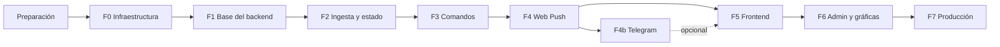

# Plan de implementación

> **Base:** [`ARQUITECTURA.md`](ARQUITECTURA.md) v1.10, que sigue siendo la fuente de verdad; las referencias § son de ese documento.
> **Estado:** borrador para revisión · 28/09/2026.
>
> **Principio:** primero las bases y después lo que depende de ellas. Cada fase usa solo lo que dejaron listo las anteriores, y se cierra con sus pruebas en verde, su criterio de "hecho" (§14) y un commit.

## Orden de las fases

| Fase | Depende de | Deja listo |
|---|---|---|
| Preparación | — | Herramientas verificadas y repositorio git |
| F0 · Infraestructura | Preparación | Contenedores, broker con TLS y ACL, imagen que compila React, simulador de la central |
| F1 · Base del backend | F0 | Esquema y migraciones, sesiones y permisos, casas, contrato OpenAPI |
| F2 · Ingesta y estado | F1 | Estado en vivo, alarmas, eventos, lecturas y WebSocket |
| F3 · Comandos | F2, porque el `estado` es lo que confirma cada comando | El servicio de comandos, que después reutilizan Web Push y Telegram |
| F4 · Web Push | F3, porque los avisos dicen quién silenció y el botón Silenciar crea comandos | Notificador por canales, recordatorios y preferencias |
| F4b · Telegram (opcional) | F3 y F4 | Segundo canal, con botón Silenciar |
| F5 · Frontend | F1 a F4 (y F4b para su sección del perfil) | La PWA completa, sobre una API ya estable |
| F6 · Admin y gráficas | F5 (vistas) y F2 (lecturas) | Invitaciones, miembros, ajustes, gráficas y retención |
| F7 · Producción | Todo lo anterior | El sistema en el servidor, con la ESP32 real |

## Reglas para todas las fases

- Antes de empezar, releer la fase en §14 y las secciones que cita.
- Primero la lógica pura con sus pruebas; después se conecta a MQTT, a la base de datos o a la red.
- Al cerrar: `ruff check`, `ruff format --check` y `pytest -q`. Si se tocó el frontend, también `npm run lint`, `npm test` y `npm run build`.
- Si cambia un endpoint o un esquema: `exportar-openapi` y `npm run tipos` (lo vigila `test_openapi_sincronizado`).
- Todo debe funcionar con `TELEGRAM_BOT_TOKEN` vacío. El firmware no se toca.
- Al verificar el criterio de "hecho": commit y push a GitHub (uno por fase), "Fase actual" actualizada en `CLAUDE.md`, y la siguiente fase empieza después de tu revisión.

## Preparación

1. Verificar las herramientas: Docker Desktop (con WSL 2), Node 24, Python 3.12 con `uv`, y git.
2. `git init` y `.gitattributes` con `* text=auto eol=lf`. Sin esto, el `core.autocrlf` de Windows rompería los `.sh` y la configuración de Mosquitto dentro de los contenedores.
3. Primer commit: especificación, firmware de referencia y este plan.

## F0 · Infraestructura

1. **Compose:** `docker-compose.yml` (3 servicios, redes `proxy` e `interna`), `docker-compose.dev.yml`, `.env.example`, `.dockerignore` y `caddy/alarma.caddy`. En local, `.env` de desarrollo y la red `alarma_proxy_dev`.
2. **Mosquitto:** `mosquitto.conf` y `acl`, con el usuario `backend_api`.
3. **Scripts:**
   - `generar_certs_mqtt.sh`: CA propia y certificado con SAN = `DOMINIO`. Usa `MSYS_NO_PATHCONV=1` para que Git Bash no convierta `-subj "/CN=…"` en una ruta de Windows, y deja `server.key` legible para el usuario del contenedor.
   - `usuario_mqtt.sh`, como describe §5.4: contenedor temporal, crea `passwd` si falta, valida el nombre y recarga con `HUP`.
   - `backup.sh`.
4. **Simulador de la central** (`tools/simulador_central.py`): LWT, `estado` cada 5 s con el formato de §4.3 y comandos, más un menú para disparar alarmas, desconectar nodos, reiniciar la central y cortar sin `disconnect`. Usa `paho-mqtt` con hilos, así funciona igual en Windows. Va antes que la API porque sirve para validar el broker, el ACL y el LWT.
5. **Esqueleto del frontend:** Vite + React 19 + TS ~5.9 + Tailwind 4, la página "Monitoreo del hogar", ESLint, Prettier, Vitest y el proxy de desarrollo.
6. **Esqueleto de la API:** `pyproject.toml` (con grupo `dev`), `config.py`, `main.py`, `web.py` (respaldo SPA, 404 JSON en `/api/*`, cabeceras y CSP), `/api/v1/salud` básico, Alembic sin migraciones, ruff y pytest.
7. **`backend/Dockerfile`** multi-etapa.

**Hecho:** el criterio de F0 en §14. El compose de desarrollo levanta; la API sirve React con respaldo SPA y da 404 JSON en rutas de API inexistentes; `npm run dev` funciona con el proxy; `backend_api` ve lo que publica el simulador, y el ACL aísla a cada central.

## F1 · Base del backend

1. `config.py` completo y `db.py` (engine async, pool, sesión en UTC).
2. `models.py` y migración inicial: todas las tablas de §7.2 salvo las de Telegram, con `CHECK`, `NULLS NOT DISTINCT` e índices parciales de §7.3 revisados a mano.
3. Base de pruebas: PostgreSQL 17 con testcontainers, fixture `sesion_db` con rollback y cliente `httpx`.
4. Seguridad: Argon2id en threadpool (el único worker también atiende MQTT), sesiones con cookie y renovación deslizante, CSRF por `Origin`, rate limit en memoria y dependencias de permisos (§12.5).
5. Endpoints: `/auth/*` (§8.1), casas y ajustes (§8.3, salvo `/estado`) y `/salud` con la base de datos.
6. CLI: `crear-superadmin`, `crear-casa`, `reset-clave` y `exportar-openapi`.
7. Contrato: `frontend/openapi.json`, `npm run tipos` y `test_openapi_sincronizado`.

**Hecho:** `upgrade head` y `downgrade base` funcionan; las pruebas de auth, CSRF, rate limit y aislamiento entre casas pasan; `/api/v1/docs` muestra la API y el OpenAPI está sincronizado.

## F2 · Ingesta y estado

1. **Núcleo puro, con pruebas:** `protocolo.py` (espejo de `protocolo.h`), parser `EstadoCentral` con fixtures reales, `detector.detectar`, detección de eventos nuevos por comparación de listas (§6.4) y textos de alarma.
2. **`procesador` y `estado_cache`:**
   - abrir alarmas con `ON CONFLICT DO NOTHING RETURNING`;
   - cerrarlas con su atribución (`usuario`, `central` o `automatica`);
   - eventos, incluido el horario de la habitación;
   - importación de eventos y upsert de `estado_actual` en una sola transacción.
3. **`mqtt_ingesta`:** suscripciones, reconexión de 1 a 30 s, `online` y mensajes retenidos (§6.3).
4. **`vigilante_central`** y **`muestreo_lecturas`** (solo nodos en línea, máximo 1 por minuto y casa).
5. **Salida:** `ws_hub` y `/ws/v1/casas/{id}`, `GET /estado`, y `GET /alarmas` y `GET /eventos` con cursor.

**Hecho:** con el simulador, el estado llega por WS; las alarmas se abren y cierran en la BD, incluida la de central caída; un reinicio de la central no cierra alarmas por error y queda en el historial; no hay eventos duplicados; un nodo apagado no genera lecturas.

## F3 · Comandos

1. Núcleo puro: payload de `cmd` construido desde enums, y predicados de confirmación (§6.5).
2. Servicio `comandos`: validación, precondiciones (409), inserción y publicación con QoS 1. Es el mismo que usarán el service worker y Telegram.
3. Confirmación desde el procesador, `comandos_timeout`, mensaje WS `comando` y evento con el nombre de quien lo envió.
4. Endpoints de §8.4, con su rate limit.

**Hecho:** silenciar, activar y desactivar desde `/docs` actúan sobre el simulador y quedan `confirmado`; si no llega el `estado`, quedan `sin_confirmar`; con la central o el nodo desconectados, la API responde 409.

## F4 · Web Push

1. `generar-vapid`, `GET /push/clave-publica`, suscripciones y preferencias (`notif_webpush`).
2. `notificador` independiente del canal: `Aviso`, destinatarios, tarea aparte y canales en paralelo (§10.1).
3. Canal `webpush`: `pywebpush` en threadpool, TTL, `Urgency` y `Topic`, y manejo de errores (§10.4).
4. Disparadores de §10.1 y `recordatorios`, con sus dos intervalos.
5. `/notificaciones/prueba`.
6. Frontend mínimo para probarlo: `vite-plugin-pwa`, `sw.ts` con `push` y `notificationclick`, y un botón de suscripción. En Android se prueba con el reenvío de puertos de Chrome (`chrome://inspect`), que hace que el celular vea `localhost`.

**Hecho:** llega el push de prueba en Android; una alarma del simulador genera un push en menos de 5 s; los recordatorios de sensor y de conexión llegan a su intervalo; la caída de la central genera un push.

## F4b · Telegram (opcional)

1. Migración: `telegram_vinculos`, `codigos_telegram` y `notif_telegram`.
2. `telegram_api`: cliente httpx, reintentos y errores de §10.7.7, sin el token en los logs.
3. `telegram_bot`: long polling, `/start <código>`, `/estado`, `/desvincular`, `/ayuda` y botón Silenciar sobre el servicio de F3.
4. Canal Telegram en el notificador, endpoints `/telegram/vinculo` y estado en `/salud`.
5. Pruebas con `respx`, incluida la de token vacío.

**Hecho:** el criterio de F4b en §14; con el token vacío, todo sigue funcionando.

## F5 · Frontend

1. Base: cliente tipado (`ErrorApi`, 401 → login), TanStack Query, rutas y guardas, `Layout` y `Login`.
2. Dominio portado de la app local, con pruebas: `protocolo.ts` y `textos.ts`.
3. Tiempo real: `useCasaEnVivo` (WS → caché, reconexión y polling de respaldo) y `useAhora`.
4. Tablero: `TarjetaNodo`, banners, `InterruptorNodo` con confirmación por WS y "Silenciar todas".
5. Historial de alarmas y eventos, con cursor.
6. Perfil: clave, sesiones, Web Push con la guía de iPhone, y Telegram si está disponible.
7. PWA completa: `sw.ts` con la acción Silenciar y `pushsubscriptionchange`, manifest, aviso de nueva versión, alertas en primer plano e instalación.

**Hecho:** pasan las pruebas de §13.5, el chunk inicial queda en ≤ 150 KB gzip y el resto del criterio de F5 se verifica en celulares reales.

## F6 · Invitaciones, admin y gráficas

1. Backend: invitaciones (§8.2), miembros (§8.6, sin permitir quitar al último admin), lecturas con `date_bin` y resumen (§8.5).
2. Vistas: Invitación, Miembros (con "Copiar enlace"), Ajustes (incluido `recordatorio_conexion_min`) y Gráficas, con Recharts en carga diferida.
3. Tarea `mantenimiento`: retención de §7.5, borrando por lotes.

**Hecho:** un cuidador entra por invitación, recibe push y no ve la vista de miembros.

## F7 · Producción

1. Verificaciones del servidor (§15.1), DuckDNS (§15.2) y puerto 8883 en el router (§15.3).
2. Instalación (§15.4) y bloque en el Caddy existente.
3. Endurecimiento: `ufw`, SSH solo con llave y actualizaciones automáticas (§12.8).
4. Backups con cron y una restauración de prueba (§16).
5. Central real: configuración de §12.9 y prueba en campo (§13.4).

**Hecho:** la app abre desde datos móviles con candado válido; los otros proyectos del servidor siguen funcionando; la ESP32 real se conecta desde otra red, y un `pg_dump` se restaura con éxito.
